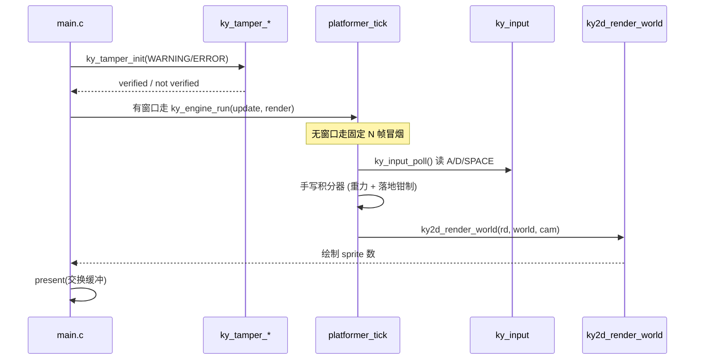
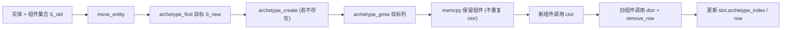

# Kronyx Engine 系统架构

## 概述

Kronyx Engine 是一个跨平台、数据导向（data-oriented）的 C11 游戏引擎，内置自定义脚本语言 `kyx`。它面向希望拥有轻量、可控、可静态链接引擎的游戏开发者，把实体组件系统、2D 渲染、刚体物理、资源管理、脚本 VM 与打包工具整合在单一 CMake 工程里。

引擎采用自下而上的分层设计：最底层是与平台无关的基础设施（数学、内存、容器、日志、时间），其上是实体组件系统（ECS）、场景与资源层；再上层是 RHI 渲染硬件抽象与 2D/动画渲染管线，以及独立的刚体物理世界；最上层是脚本 VM 与游戏绑定，把 `kyx` 脚本接入 ECS、输入与日志。窗口与游戏循环由 `ky_runtime`（GLFW）承载，反篡改门禁在引擎初始化前介入。

它使开发者能够以统一的 C 抽象驱动一个完整的 2D 平台跳跃游戏：用 ECS 描述角色/地面/相机，用 `ky2d_render_world` 批量绘制精灵，用内置物理做碰撞与射线检测，用 `kyx` 脚本绑定 `std.spawn / std.setpos / std.poll_input` 等原生函数在脚本侧驱动世界，并用 `ky_pack` 把脚本连同引擎打包为 exe、npm、jar（apk 尚为占位）。

系统对外只暴露 `include/kronyx/` 下的 C 头文件，所有动态状态封装在 `kyWorld` / `kyRenderDevice` / `kyPhysicsWorld` / `kyVM` / `kyResourceManager` 等不透明句柄内，便于静态链接与跨平台编译。

## 技术栈

**语言与运行时**
- C11（核心库、ECS、渲染、物理、脚本、打包）
- C++（反篡改共享库 `KyAntiTamper` 与 Dear ImGui 编辑器，默认不构建）

**框架与工具**
- CMake ≥ 3.20，多构建树（Release/Debug）
- 测试：CMake `ctest` + 自研断言宏（`tests/kytest.h`）
- CI/CD：GitHub Actions（ubuntu / windows / macos × Release / Debug）
- 可选 ASan/UBSan 与 LSAN 抑制

**渲染与图形**
- OpenGL ES 3（经 EGL Pbuffer）软件/硬件后端，后端名 `opengl3.3`
- 控制台回退后端（`console`），无 GL 依赖即可跑通逻辑
- GLFW 3.3 窗口与输入（`ky_runtime`）
- Dear ImGui（仅 `KYR_BUILD_EDITOR=ON` 的编辑器）

**基础设施**
- Linux（X11/Xi/Xrandr）、Windows（bcrypt/crypt32 + vcpkg glfw3）、macOS（Security.framework + Homebrew glfw）
- OpenSSL（反篡改 Linux 后端 HMAC）/ BCrypt（Windows）/ Security.framework（macOS）

**外部工具依赖**
- `cc`、`zip`（`ky_pack` 的 exe / jar 后端）

## 项目结构

```
Kronyx/
├── CMakeLists.txt                 # 顶层构建：ky_core / ky_engine / ky_runtime / ky_antitamper / KyAntiTamper / ky_demo
├── cmake/
│   └── options.cmake              # 构建开关（KYR_*）
├── include/kronyx/                # 对外公开头文件（引擎 SDK 面）
│   ├── defines.h kronyx.h         # 基座宏与聚合头
│   ├── math.h memory.h arena.h pool.h array.h hashmap.h string.h   # core 基础设施
│   ├── log.h time.h event.h input.h file.h                         # core 工具
│   ├── ecs.h scene.h resource.h   # 数据层
│   ├── render.h 2d.h anim2d.h     # 渲染层
│   ├── physics.h force_field.h    # 物理层
│   ├── script.h bindings.h gc.h   # 脚本层
│   ├── pack.h                     # 打包
│   ├── engine.h glfw.h            # 运行时窗口与循环
│   ├── editor_core.h              # 无头编辑器核心
│   └── anti_tamper.h             # 反篡改
├── src/
│   ├── core/     # math memory array hashmap string log time event input arena pool file
│   ├── ecs/      # archetype 实体组件系统
│   ├── scene/    # .ksn 场景序列化
│   ├── resource/ # 资源管理与像素缓冲
│   ├── render/   # RHI + console/GL 后端 + 2D + 动画
│   ├── physics/  # 刚体物理 + 力场
│   ├── script/   # kyx 词法/语法/编译/VM/GC/绑定
│   ├── pack/     # 打包
│   ├── engine/   # 窗口循环 + 反篡改（game/dll）
│   └── demo/     # 2D 平台人垂直切片
├── tools/
│   ├── editor/   # Dear ImGui 编辑器（KYR_BUILD_EDITOR）
│   └── mk_demo_asset.c  # 生成 8x8 demo 资产
├── tests/        # ctest 套件（20 个目标）
├── assets/       # hero_8x8.bin
├── docs/         # 架构白皮书 / index.html
├── .github/workflows/build.yml  # CI
└── lsan.supp     # LSAN 抑制
```

**入口点**
- `src/demo/main.c` - `ky_demo` 可执行程序入口（有窗口循环 / 无头冒烟）
- `include/kronyx/kronyx.h` - 引擎聚合头（不含 2d/anim2d/event/input/file）
- `tools/editor/src/editor_main.c` - 有窗编辑器入口（默认不构建）

## 子系统

### Core 基础设施
**目的**: 提供零外部依赖的数学、内存、容器、日志、时间、事件、输入、文件读取。
**位置**: `src/core/` + `include/kronyx/*.h`
**关键文件**: `math.c memory.c array.c hashmap.c string.c log.c time.c event.c input.c arena.c pool.c file.c`
**依赖**: `m`（UNIX）
**被依赖**: 所有上层模块

### ECS 实体组件系统
**目的**: Archetype 布局的实体组件系统，O(1) 实体→slot 查找，组件按 SoA 列存储。
**位置**: `src/ecs/ecs.c` + `include/kronyx/ecs.h`
**关键文件**: `ecs.c`（内含 `move_entity` 迁移与 `ky_view_*`）
**依赖**: core（array/hashmap/memory）
**被依赖**: scene、2d、anim2d、bindings、editor_core、demo

### Scene 场景层
**目的**: 维护带元数据的 ECS 世界，并以 `.ksn` 文本格式保存 / 加载场景。
**位置**: `src/scene/scene.c` + `include/kronyx/scene.h`
**依赖**: ecs、2d（组件类型）、core（file/string）
**被依赖**: demo、测试

### Resource 资源层
**目的**: 以 path 为键引用计数的资源注册表，支持像素缓冲 / 原始字节 payload 与自定义析构。
**位置**: `src/resource/resource.c` + `include/kronyx/resource.h`
**依赖**: core（hashmap/array/memory）
**被依赖**: 2d（纹理）、demo

### Render 渲染层
**目的**: RHI 抽象（vtable 命令列表）+ console / GL 后端；2D 精灵批量渲染 + 帧动画。
**位置**: `src/render/` + `include/kronyx/render.h 2d.h anim2d.h`
**关键文件**: `render.c render_backend.h console_backend.c gl_backend.c 2d.c anim2d.c`
**依赖**: core（math/memory/log）、ECS
**被依赖**: 2d、demo、editor_core、pack

### Physics 物理层
**目的**: 刚体世界（SAP X 轴 broadphase + AABB 最小穿透轴 push-apart narrowphase）、力场、射线检测、`KY_EVENT_COLLIDE` 事件。
**位置**: `src/physics/` + `include/kronyx/physics.h force_field.h`
**关键文件**: `physics.c force_field.c physics_internal.h`
**依赖**: core（event/memory）、math
**被依赖**: demo、bindings

### Script 脚本层（kyx）
**目的**: `kyx` 词法/语法/寄存器 VM/分代 GC，并把 `std.*` 游戏绑定接入 ECS 与输入。
**位置**: `src/script/` + `include/kronyx/script.h bindings.h gc.h`
**关键文件**: `script.c parser.c vm.c gc.c bindings.c`
**依赖**: core、ECS（bindings）、input（bindings）
**被依赖**: demo、pack

### Pack 打包
**目的**: 将 `kyx` 脚本连同引擎打包为 exe / npm / jar（apk 占位不实现）。
**位置**: `src/pack/pack.c` + `include/kronyx/pack.h`
**依赖**: core、`ky_engine`（链接）、`cc`/`zip`
**被依赖**: 工具链

### Runtime 运行时
**目的**: GLFW 窗口、输入轮询与 `update/render` 游戏循环封装。
**位置**: `src/engine/engine.c glfw.c` + `include/kronyx/engine.h glfw.h`
**依赖**: core、GLFW
**被依赖**: demo

### Anti-Tamper 反篡改
**目的**: HMAC-SHA256 + TOTP 5 轮往返挑战-响应门禁，双组件（静态库 + 共享库）。
**位置**: `src/engine/anti_tamper_game.c anti_tamper_dll.cpp` + `include/kronyx/anti_tamper.h`
**依赖**: core、OpenSSL/BCrypt/Security.framework
**被依赖**: demo、engine.h（含入）

### Editor 编辑器
**目的**: Dear ImGui 可视化面板（viewport / hierarchy / properties / console）与无头核心 `editor_core`。
**位置**: `tools/editor/` + `include/kronyx/editor_core.h`
**关键文件**: `editor.c editor_core.c editor_main.c viewport_panel.c hierarchy_panel.cpp properties_panel.cpp console_panel.cpp`
**依赖**: ky_engine、ky_core、ImGui、GLFW、OpenGL
**被依赖**: `KYR_BUILD_EDITOR` 时构建

### Demo 平台人切片
**目的**: 2D 平台人垂直切片，串联 ECS + 2D + 物理 + 资源 + 反篡改；支持有窗 / 无头冒烟。
**位置**: `src/demo/`
**关键文件**: `main.c platformer_world.c platformer_world.h`
**依赖**: ky_engine、ky_runtime、ky_antitamper、ky_core
**被依赖**: `ky_test_demo_loop`

## 图表

### 系统分层与模块依赖

```mermaid
flowchart TB
    subgraph App["应用 / 工具"]
        Demo["ky_demo 平台人"]
        Editor["ImGui Editor (可选)"]
        Pack["ky_pack 打包"]
    end

    subgraph KYX["Kronyx 脚本层"]
        Script["kyx VM + GC"]
        Binds["std.* 绑定 (KyxBinds)"]
        Script --> Binds
    end

    subgraph EngineLayer["引擎数据层"]
        ECS["ECS (archetype)"]
        Scene["Scene (.ksn)"]
        Resource["Resource Manager"]
        Physics["Physics (SAP + AABB)"]
        Scene --> ECS
        Scene --> Resource
    end

    subgraph RHI["渲染层"]
        RHI["RHI + 命令列表"]
        TwoD["2D 渲染管线"]
        Anim["帧动画 kyanimator"]
        TwoD --> RHI
        Anim --> TwoD
    end

    subgraph Platform["平台层"]
        Window["ky_runtime (GLFW)"]
        Input["ky_input"]
        Event["ky_event"]
        Anti["Anti-Tamper 门禁"]
    end

    Core["core (math/memory/containers/log/time/file)"]

    Demo --> Window
    Demo --> ECS
    Demo --> TwoD
    Demo --> Physics
    Demo --> Anti
    Binds --> ECS
    Binds --> Input
    TwoD --> ECS
    TwoD --> RHI
    RHI --> Core
    ECS --> Core
    Scene --> Core
    Resource --> Core
    Physics --> Core
    Script --> Core
    Pack --> Resource
    Editor --> ECS
    Editor --> RHI
```

### Demo 一帧执行流程



### Archetype ECS 实体迁移



## 设计决策

- **Archetype SoA 布局**：按组件集合分桶，同集合实体共享列，组件查找 O(1) + O(log k)，避免逐实体组件指针的缓存不友好。
- **RHI vtable 立即模式**：命令列表指针首字段绑定 `kyRenderDevice`，`KY_STATIC_ASSERT(offsetof(cl, rd)==0)` 保证分派安全；后端命令列表为立即执行（非延迟缓冲），降低复杂度。
- **脚本句柄 64 位**：实体句柄 `int64(version<<32|id)` 因 `op_loadint` 仅 32 位、`op_return` 强转 double，必须作为 `ky_vm_call` 实参逐值拷贝传入，字面量/返回值均不可承载。
- **反篡改双组件**：静态库 `ky_antitamper`（exe 内复核 + 上报）与共享库 `KyAntiTamper`（跨进程挑战-响应）分离，防止单点篡改；Linux rpath 用 `$ORIGIN` 定位同目录 `.so`。
- **手写积分器代替物理窄相**：内置窄相沿最小穿透轴 push-apart，对"垂直落到平面"接触约束不足，demo 因此自实现重力 + 落地钳制的 2D 积分器，把角色稳定压在地面。
- **2D 批次化渲染**：按 `layer→z→id` 排序后，同纹理相邻 sprite 归批，单批 ≤ `KY2D_MAX_SPRITES_BATCH`，纹理变更即断开新批；`g_vbo` / `g_ibo` 为文件级静态缓存。
- **场景序列化 .ksn 纯文本**：实体名写为 `id(version)`，组件属性用 `key="value"`；加载以 `transform` 为必填组件（缺失返回 -4），实体数上限 64。
- **资源引用计数 + on_destroy**：`payload` 不透明指针，`kind` 决定解读方式；`release` 归零触发 `on_destroy` 与结构释放，`ky_resmgr_destroy` 强制销毁全部。

## 已知偏差（文档必读）

`README.md` / `docs/Kronyx_架构设计白皮书.md` 与当前代码存在以下偏差，本文档以**实际代码**为准：

| 项 | README / 白皮书 | 实际实现 |
|----|----------------|----------|
| 物理窄相 | GJK/EPA 窄相 + PGS 求解 | AABB 最小穿透轴 push-apart，无迭代求解 |
| 摩擦 / 弹性 | `restitution` / `friction` 生效 | 字段存在但从未使用 |
| SAP broadphase | 多轴 SAP | 仅 X 轴单扫掠线 |
| 角色运动 | 刚体窄相 | 手写 2D 积分器 |
| `OP_CALL` 递归帧 | 标准栈帧 | `stack_top` 恒 0，帧窗口共享 |
| 字符串常量池 | 二进制安全 | NUL 终止串，`ky_hashmap` 用 `strcmp` |
| `std.spawn / std.setpos` | `KY_API` 导出 | 仅 11 个 `std.*` native，无事件 native |
| 资源加载 | 二进制 `.res` | 仅 `ky_resmgr_make_pixelbuffer` / `make_raw_bytes` |
| 音频 / 动画 / 关节 / Vulkan | 路线图标记 | 音频/关节/Vulkan 未实现；帧动画已落地 |

> 以上"实际实现"均直接来自源码注释、`ctest` 断言、以及 `progress.md` 中的交付/已知债清单。

## 文档导航

- 系统架构：[ARCHITECTURE.md](./ARCHITECTURE.md)
- 接口 API：[INTERFACES.md](./INTERFACES.md)
- 开发者指南：[DEVELOPER_GUIDE.md](./DEVELOPER_GUIDE.md)
- 核心概念：[专有概念/](./专有概念/)
- 模块 README：[模块/](./模块/)
- 总索引：[INDEX.md](./INDEX.md)
