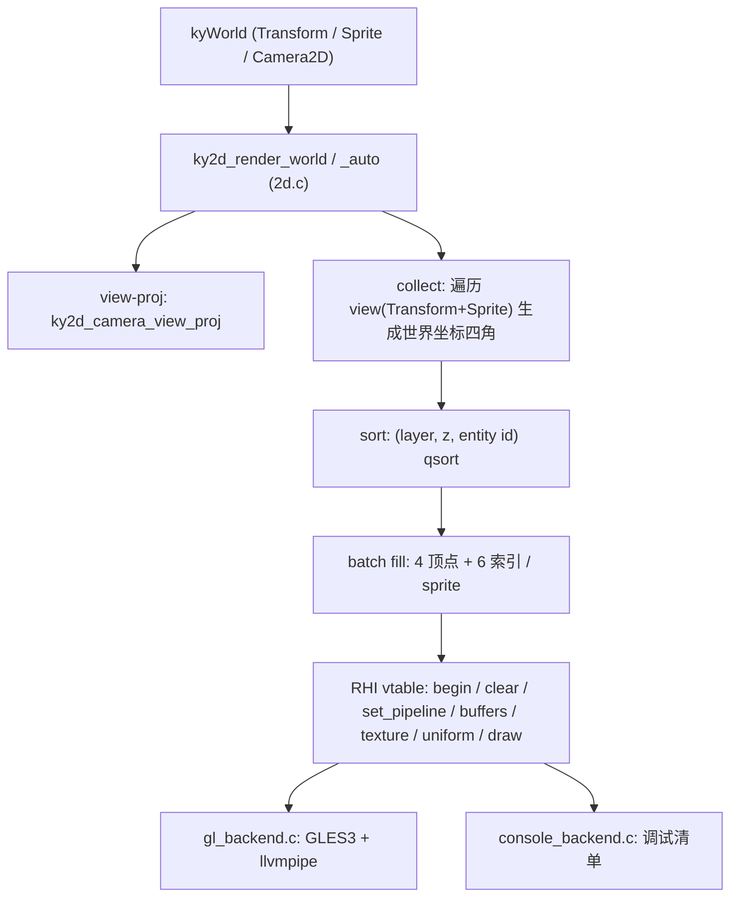

# 2D Render Pipeline — Technical Design

Feature Name: 2d-render-pipeline
Updated: 2026-09-05
Depends on: RHI vtable (render.h), ECS archetype (ecs.h), math (math.h)

## Description

在 ky_engine 内新增 2D 渲染层 `src/render/2d.c`（头文件 `include/kronyx/2d.h`），提供 Transform / Sprite / Camera2D 三个 ECS 组件与一个 batch 渲染入口。渲染时 CPU 只生成世界坐标顶点，view-proj 矩阵经 uniform 传入 shader 做 GPU 变换；单批最多 4096 个 Sprite（u16 索引），超出自动分批。GL 后端走内置 GLES3 shader + alpha blend，console 后端在调试开关开启时输出排序后的 Sprite 清单。

## Architecture



数据流：`ky2d_render_world` 单次调用即一帧 —— `ky_rd_begin` → `ky_rd_clear` → 逐批 `set_pipeline/set_vertex_buffer/set_index_buffer/set_texture/set_uniform/draw_indexed` → `ky_rd_submit` → `ky_rd_present`。

## Components and Interfaces

### 2d.h 公共 API

```c
// 三组件（见 Data Models）
KY_API int        ky2d_register_components(kyWorld *w);
KY_API kyTransform ky_transform_new(void);
KY_API kySprite    ky_sprite_new(void);
KY_API kyCamera2D  ky_camera2d_new(void);

// 渲染入口；cam 为显式相机实体（需同时有 Camera2D 组件）
// 返回值: >=0 本帧绘制的 sprite 数；<0 参数错误
KY_API int    ky2d_render_world(kyRenderDevice *rd, kyWorld *w, kyEntity cam);
// 自动选 active==1 且实体 id 最小的相机；无则返回 0
KY_API int    ky2d_render_world_auto(kyRenderDevice *rd, kyWorld *w);

// console 后端调试清单开关（默认关）
KY_API void   ky2d_render_debug(int on);

// 导出相机视图投影矩阵（测试与脚本用）
KY_API kyMat4 ky2d_camera_view_proj(const kyCamera2D *cam, const kyTransform *tr);
```

设计决策：

1. **入口拆分 `_auto`**：`ky_world_spawn` 首实体 id=0（ecs.c:242），用 "id==0 表示自动" 会与合法实体冲突，故 auto 语义独立成函数。
2. **GPU 变换**：CPU 只算世界坐标，`u_vp` uniform 一次提交批内共享；相机每帧变动无需重填顶点。
3. **显式 uniform location**：GLES3 支持 `layout(location=0)`，与 gl_backend 按 bytes 分派的 glUniform 路径对齐（64 bytes → glUniformMatrix4fv）。
4. **惰性创建 + 静态缓存**：shader/pipeline/顶点缓冲/白纹理首次绘制时创建，按设备指针静态缓存（V1 假定单 RenderDevice）。
5. **顶点色 4ub**（用户已确认）：stride 20 字节。
6. **console 调试开关**（用户已确认）：`ky2d_render_debug(1)` 后每帧输出清单。

### CMake 变更

`ky_engine` 源列表追加 `src/render/2d.c`；新增 `ky_test_2d`（链接 ky_engine）注册 ctest `2d`。

## Data Models

```c
typedef struct kyTransform {
    kyVec2 pos;          // EU
    float  rotation_z;   // 弧度，逆时针
    kyVec2 scale;        // 默认 (1,1)
    float  z;            // 排序次键
} kyTransform;

typedef struct kySprite {
    kyTexture *texture;  // NULL = White Texture
    kyVec4    color;     // 默认 (1,1,1,1)
    kyVec2    size;      // EU，随 Transform.scale 二次缩放
    kyVec2    uv0, uv1;  // 默认 (0,0)-(1,1)
    int       layer;     // 排序主键
    uint8_t   flip;      // bit0=X bit1=Y
} kySprite;

typedef struct kyCamera2D {
    kyVec2 pos;
    float  rotation_z;
    float  zoom;         // 默认 1.0，像素 = EU * zoom
    kyVec2 viewport;     // EU
    kyVec4 clear_color;  // 默认 (0.1,0.1,0.1,1)
    int    active;
} kyCamera2D;

// 顶点：stride 20
typedef struct ky2dVertex {
    float   x, y;        // 世界坐标 EU
    float   u, v;
    uint8_t r, g, b, a;  // normalized
} ky2dVertex;
```

排序 key：`(layer asc, z asc, entity id asc)`，qsort 稳定输出。

view-proj：`V = T(-pos) · Rz(-rot) · S(1/zoom)`，`P = ortho(-vw/2, vw/2, -vh/2, vh/2, -1, 1)`，`vp = P · V`。

内置 shader：

```glsl
// vs (GLES3)
layout(location=0) in vec2 a_pos;
layout(location=1) in vec2 a_uv;
layout(location=2) in vec4 a_color;   // normalized ub
layout(location=0) uniform mat4 u_vp;
out vec2 v_uv; out vec4 v_color;
void main(){ v_uv=a_uv; v_color=a_color; gl_Position=u_vp*vec4(a_pos,0.0,1.0); }

// fs
precision mediump float;
in vec2 v_uv; in vec4 v_color;
layout(location=0) uniform sampler2D u_tex;  // slot 0
out vec4 frag;
void main(){ frag = texture(u_tex, clamp(v_uv, 0.0, 1.0)) * v_color; }
```

attrib layout：loc0 pos 2f @0，loc1 uv 2f @8，loc2 color 4ub normalized @16，stride 20；blend on (SRC_ALPHA, ONE_MINUS_SRC_ALPHA)，depth off。

## Correctness Properties

- P1: layer 大的 Sprite 覆盖 layer 小的（像素级可断言）
- P2: 相机平移 d EU → Sprite 屏幕位置偏移 d·zoom 像素
- P3: 无 active 相机 / 无 Sprite / NULL 参数时函数返回值符合契约且无崩溃
- P4: Sprite 数 > 4096 分批后画面与单批等价（批边界处颜色连续）
- P5: Transform.scale==0 的 Sprite 产生 0 顶点、0 draw
- P6: 排序输出对 (layer, z, id) 全序确定，重复调用结果一致
- P7: 白纹理路径下 Sprite 呈现 color 原色

## Error Handling

| 场景 | 行为 |
|------|------|
| rd 或 world NULL | 返回 KY_ERR 负码，不触碰 RHI |
| cam 实体无效或无 Camera2D | 返回负码，log 一条 |
| viewport 宽或高 <= 0 | 视为无效相机，返回 0 |
| GL shader/pipeline 创建失败 | ky_log_write ERROR + 返回负码，后续帧重试创建 |
| 无 Transform 的 Sprite | 用恒等 Transform 渲染，每帧每类至多 1 条警告 |

## Test Strategy

新测试 `tests/test_2d.c`（ctest `2d`）：

1. **组件层**（无后端）：register_components 幂等、三组件默认值、重复注册复用 type_id
2. **数学层**：camera_view_proj 将相机位置映射到 clip 原点；zoom=2 时 EU→2 NDC 单位；rotation_z=90° 后 x/y 交换符号
3. **收集/排序层**：注入 3 个乱序 sprite（不同 layer/z），断言排序 key 输出全序；scale==0 顶点数为 0
4. **GL 像素级**（EGL surfaceless，复用 test_render 的 glReadPixels 手法）：
   - 红色 sprite 在屏幕中心 → 中心像素为红
   - 蓝色 sprite layer 更大且重叠 → 采样点为蓝（P1）
   - 相机平移 +1 EU → 红色像素位置按 zoom 比例移动（P2）
   - 棋盘格纹理 sprite → uv 采样颜色正确
5. **console 后端**：debug 开启后跑一帧不崩溃、输出含 sprite 条目

回归：7 个既有套件全绿。

## References

[^1]: include/kronyx/render.h#L48-L89 — RHI 管线/命令 API
[^2]: include/kronyx/ecs.h#L12-L19 — kyComponentType 注册结构
[^3]: src/ecs/ecs.c#L230-L242 — spawn id 从 0 起（入口拆分依据）
[^4]: src/render/gl_backend.c — glUniform 按 bytes 分派、EGL surfaceless 上下文
[^5]: tests/test_render.c — glReadPixels 像素级验证手法
