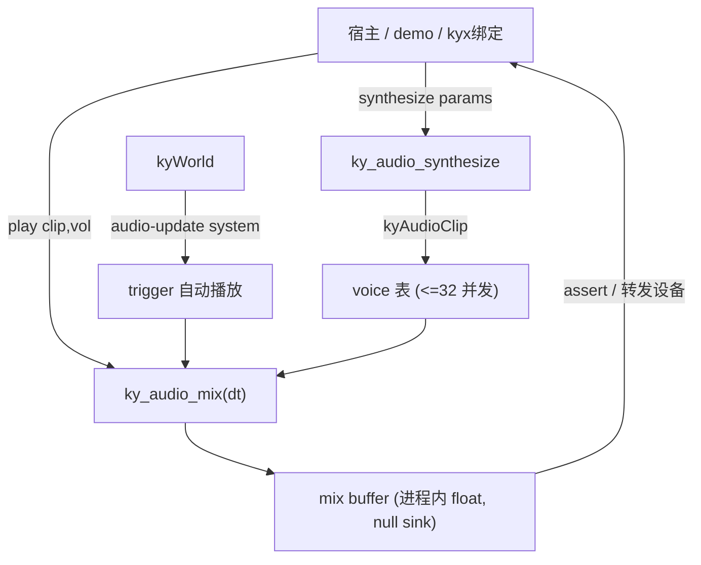

# G11 音频模块 设计文档

Feature Name: audio-system
Updated: 2026-09-29

## Description

纯 C 的 PCM SFX 合成器 + 混音器，ECS 组件化接入，null sink 输出到进程内
mix buffer。无系统音频库依赖，与 console 渲染 / 粒子同策略：无头可测、
宿主零配置、确定性可复现。

## Architecture



## Components and Interfaces

### `include/kronyx/audio.h`（新）

```c
#define KY_AUDIO_SAMPLE_RATE 44100
#define KY_AUDIO_MAX_VOICES  32
#define KY_AUDIO_MIX_MAX     (44100*2)

typedef enum kySfxKind {
    KY_SFX_SINE_SWEEP = 0,  /* 正弦扫频 freq0->freq1 */
    KY_SFX_SQUARE,          /* 方波, 单一 freq */
    KY_SFX_NOISE,           /* LCG 白噪声 burst, seed 可设 */
    KY_SFX_CLICK,           /* 短促衰减脉冲 */
} kySfxKind;

typedef struct kySfxParams {
    kySfxKind kind;
    float    duration;   /* 秒, >0 */
    float    freq0;      /* Hz */
    float    freq1;      /* Hz, 扫频终点; SQUARE/NOISE/CLICK 忽略 */
    float    amplitude;  /* 0..1 */
    uint32_t seed;       /* 噪声可复现; 0 -> 0x12345678 */
} kySfxParams;

typedef struct kyAudioClip {
    float  *samples;     /* 长度 = ceil(duration*SR) */
    size_t  sample_count;
    uint32_t alive;      /* clip_free 置 0, voice 据此安全跳过 */
} kyAudioClip;

/* ECS 组件: 挂实体上, trigger 本帧置 1 时自动播放一次并清零 */
typedef struct kySoundEmitter {
    kyAudioClip *clip;   /* NULL 用模块内置 click */
    float volume;        /* 0..1 */
    int   trigger;       /* 宿主置 1, 系统消费后清零 */
} kySoundEmitter;
```

API：

| 函数 | 说明 |
|------|------|
| `kyAudioClip *ky_audio_synthesize(const kySfxParams *p)` | 参数 -> 波形；NULL/非法返回 NULL |
| `void ky_audio_clip_free(kyAudioClip *c)` | 释放波形；NULL 空操作；置 `alive=0` 前 voice 仍安全 |
| `int ky_audio_play(kyAudioClip *c, float vol)` | 入队 voice；`c` 非 NULL 且 vol∈[0,1] 且 voice 未满；返回新 voice 数，满返回 -1 |
| `int ky_audio_mix(float dt)` | 推进所有 voice，累加进 mix buffer；返回写入采样数 |
| `float *ky_audio_mix_buffer(void)` | mix buffer 指针 |
| `size_t ky_audio_mix_buffer_samples(void)` | 本次 mix 写入的采样数 |
| `int ky_audio_active_count(void)` | 当前 voice 数 |
| `void ky_audio_shutdown(void)` | 回收 voice + buffer，幂等 |
| `int ky_audio_register_components(kyWorld *w)` | 注册 "sound" 组件 + "audio-update" 系统，幂等 |

### `src/audio/audio.c`（新，入 `ky_engine`）

- 静态 voice 表 `KY_AUDIO_MAX_VOICES`：`{ clip, vol, sample_idx, alive_flag_ref }`。
- 静态 mix buffer `KY_AUDIO_MIX_MAX` float，`ky_audio_mix` 每帧清零累加。
- `audio_update_sys`（order 0）：扫 `"sound"` 组件，`trigger==1` 则
  `ky_audio_play(clip, vol)` 并 `trigger=0`。
- 软限幅：合成时逐采样 clamp 到 [-1,1]。
- 噪声 LCG：`seed ? seed : 0x12345678`，xorshift32 与 particle2d 同族。

### demo 接线（`platformer_world.{h,c}`）

- 模块启动时合成一次 `jump_clip`（SINE_SWEEP 0.08s）与 `land_clip`（CLICK）。
- 跳跃请求成功 -> `ky_audio_play(jump_clip, 0.6f)`；落地 grounded 0->1
  -> `ky_audio_play(land_clip, 0.4f)`。
- 每 tick 末尾 `ky_audio_mix(dt)`；teardown 释放两 clip + `ky_audio_shutdown()`。

## Data Models

- **voice 槽**：`struct { kyAudioClip *clip; float vol; size_t idx; }`，
  固定 32，线性扫描回收空槽（32 上限，O(32) 可接受）。
- **mix buffer**：`float[KY_AUDIO_MIX_MAX]`，每帧 `memset 0` 后按
  `idx += 1` 步进累加 `clip->samples[idx] * vol`。

## Correctness Properties

- 合成确定性：同 `kySfxParams` 逐采样相等（噪声靠 seed）。
- voice 上限静默丢弃，`active_count` 永不 > 32。
- `clip->alive==0` 的 voice 在下一次 mix 被安全跳过（不读 `samples`）。
- mix buffer 写入数 = `min(ceil(dt*SR), KY_AUDIO_MIX_MAX)`。

## Error Handling

- 非法参数（duration<=0 / kind 越界 / NULL p）-> 合成返回 NULL，无副作用。
- voice 满 -> `ky_audio_play` 返回 -1，不崩溃。
- 提前 free clip -> `alive` 标志守卫，ASan 干净。
- NULL world 注册 -> 返回 -1。

## Test Strategy

`tests/test_audio.c`（目标 ~30 断言），ctest 目标 `audio`：

1. 合成：四种 kind 非 NULL + 长度正确；非法参数 NULL；确定性（同参数
   逐采样相等，含噪声同 seed）。
2. 软限幅：对每个 kind 断言所有采样 ∈ [-1,1]。
3. 播放：单 voice -> `active_count` +1；32 个并发 -> 第 33 个返回 -1 且
   计数保持 32。
4. mix：dt 正常 -> 返回采样数 = ceil(dt*SR) 且 buffer 含非零；
   dt<=0 -> 返回 0、不动 voice、不清 buffer。
5. clip 生命周期：play 后 free clip -> 再 mix 不崩（ASan），voice 回收。
6. ECS 集成：注册组件 + 挂 `kySoundEmitter{trigger=1}` -> `ky_world_step`
   后 trigger 清零且 active_count 增加。
7. shutdown 后 active_count 归零。

## 实施步骤

1. `include/kronyx/audio.h` + `src/audio/audio.c`（合成 + voice + mix +
   ECS 系统）。
2. CMake：`audio.c` 入 `ky_engine`；`ky_test_audio` 挂 ctest（22→23）。
3. demo 接线跳跃/落地音效 + 每 tick mix + teardown。
4. `tests/test_audio.c` + CMake。
5. 全量 `ctest -j1` + ASan `detect_leaks=0` + `ky_demo` 无头冒烟。
6. 回写 `progress.md` G11 完成 + `.monkeycode/docs/模块/Audio.md` 活契约。

## References

- 粒子模块同模式：`include/kronyx/particle2d.h`（组件 + 系统 + 静态池 +
  确定性 LCG + null/console 零依赖输出）。
- 渲染 console 后端策略：`src/render/console_backend.c`（无依赖回退）。
- demo tick 结构：`src/demo/platformer_world.c`（jump/grounded 脉冲，
  G10 已加 emit_pulses，音效脉冲同位置）。
