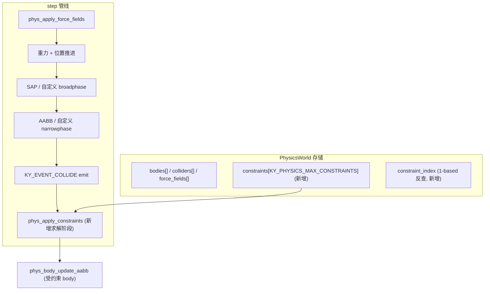

# 关节 / 物理约束系统（G9）

Feature Name: joint-constraints
Updated: 2026-10-02

## Description

在物理模块（`src/physics/physics.c` + `include/kronyx/physics.h`）内新增
distance / hinge 两种运动学约束，落地在 `ky_physics_step` 末尾的求解阶段，
按 `inv_mass` 权重做"位置投影 + 速度消除"的单次迭代求解（Box2D 简化风格，
不做多子步）。静止端以 `body == 0` 表达（无穷质量，anchor 为世界坐标）。
不改动 SAP 窄相、碰撞事件、力场管线；约束求解阶段在碰撞事件 emit 之后运行，
不触发 `KY_EVENT_COLLIDE`。

前置：G1 可玩、G8 碰撞回调已完成。

## Architecture



## Components and Interfaces

### `include/kronyx/physics.h`（新增 API）

```c
typedef enum kyConstraintType {
    KY_CONSTRAINT_DISTANCE = 0,
    KY_CONSTRAINT_HINGE,
} kyConstraintType;

typedef struct kyConstraintDesc {
    kyConstraintType type;
    uint32_t body_a, body_b;   /* 0 = 静止世界 (anchor 为世界坐标) */
    kyVec3   local_a, local_b; /* body 局部坐标锚点; body==0 时即世界坐标 */
    float    distance;          /* DISTANCE: 目标距离 */
    float    angle_offset;     /* HINGE: 角度差 */
    int      enabled;
} kyConstraintDesc;

#define KY_PHYSICS_MAX_CONSTRAINTS 256

KY_API uint32_t ky_physics_add_constraint(kyPhysicsWorld *pw, const kyConstraintDesc *desc);
KY_API int      ky_physics_remove_constraint(kyPhysicsWorld *pw, uint32_t id);
KY_API int      ky_physics_get_constraint_count(const kyPhysicsWorld *pw);
```

### `src/physics/physics_internal.h`（新增存储）

```c
typedef struct kyPhysConstraint {
    kyConstraintDesc desc;
    int  alive;
    uint32_t id;
} kyPhysConstraint;
```

`kyPhysicsWorld` 增加：

```c
    kyPhysConstraint constraints[KY_PHYSICS_MAX_CONSTRAINTS];
    int               constraint_count;
    uint32_t          next_constraint_id;
```

（不引入 `constraint_index` 反查表——约束按注册顺序逐条处理，移除用 `alive` 标志
而非 compaction，与 `force_fields` 的 `find_force_field` 扫描模式一致，避免
O(n) memmove 的 compaction 成本。容量 256 规模下逐条扫描可接受。）

### `src/physics/physics.c`（新增）

- `ky_physics_add_constraint`：校验（`pw/desc/type/enabled`、双端 body id 合法性、
  满容量）→ 分配 1-based id → 写 `constraints[count]`（清零 + `*desc`）→ 返回 id。
- `ky_physics_remove_constraint`：线性找 `alive && id` 匹配项 → `alive = 0`；未找到返回 0。
- `ky_physics_get_constraint_count`：返回 `constraint_count`（累计成功添加数；
  与"活跃数"不同，remove 后 count 不变——测试断言累计语义）。
  修正：按 Requirement 5 AC2，count 返回累计成功添加数，故 **不加** compaction。
- `phys_apply_constraints(pw, dt)`：在 `ky_physics_step` 的碰撞事件 emit 之后调用，
  对每条 `alive` 约束按 type 调 `solve_distance` / `solve_hinge`，最后对受约束 body
  重新 `phys_body_update_aabb`。

**anchor 世界坐标计算**（两端共用；`desc->local_a/local_b` 语义：
当 body 非 0 时视为该 body 的局部坐标，当 body == 0 时视为世界坐标）：

```c
static kyVec3 constraint_anchor_world(const kyRigidBody *b, const kyVec3 *local) {
    if (!b) return *local;                     /* 静止端: local 即世界坐标 */
    return ky_vec3_add(b->position, ky_quat_rotate(b->rotation, *local));
}
```

### 求解器（文件内 static）

`solve_distance`：
1. 求两端 anchor 世界坐标 `wa` / `wb`。
2. `d = wb - wa`，`len = |d|`；若 `len < 1e-6` 则跳过（除零守卫，AC3）。
3. 方向 `n = d / len`，误差 `err = len - desc->distance`。
4. 位置端：`wa' = wa + n * err * w_a`，`wb' = wb - n * err * w_b`，
   其中 `w_a = inv_a / (inv_a + inv_b)`，`w_b = inv_b / (inv_a + inv_b)`
   （静止端 inv=0 → 权重全归活动端）。写回两端 `position`。
5. 速度端：两端 anchor 世界速度 `va = lin_a + cross(ang_a, wa - pos_a)`，
   `vb` 同理；相对速度沿 `n` 的分量 `rel = dot(vb - va, n)`；
   沿 `n` 施加冲量 `j = -rel * inv_total`，`lin_a += n*j*inv_a`，`lin_b -= n*j*inv_b`。

`solve_hinge`：
1. 两端 anchor 世界坐标 + 两端位置重合修正（同 distance 的位置端投影，但
   `err = wa - wb` 整体而非标量，按 inv_mass 权重分配）。
2. 角度端：`diff = angle_a - angle_b - desc->angle_offset`（用 `atan2` 取
   主值到 `[-pi, pi]`），`w = inv_a + inv_b`（静止端 inv=0，`w == 0` 时跳过角度修正），
   `rot_a = ky_quat_mul(ky_quat_axis_angle((kyVec3){0,0,1}, -diff * inv_a / w), rot_a)`，
   `rot_b = ky_quat_mul(rot_b, ky_quat_axis_angle((kyVec3){0,0,1}, diff * inv_b / w))`
   （2D 场景绕 Z 轴；`kyRigidBody.rotation` 为 `kyQuat`，用 `ky_quat_axis_angle` 构造
   修正增量后 `ky_quat_mul` 合成，再用 `ky_quat_normalize` 防漂移）。
3. 速度端：消除两端 anchor 世界速度的相对分量（同 distance 的速度端）。

## Data Models

**约束存储**（文件内 `kyPhysConstraint`，见 internal）：

```c
typedef struct kyPhysConstraint {
    kyConstraintDesc desc;  /* 含 type/body_a/body_b/local_a/local_b/distance/angle_offset/enabled */
    int      alive;
    uint32_t id;            /* 1-based 公共 id */
} kyPhysConstraint;
```

`body == 0` 语义：`inv_mass` 权重为 0（静止端），anchor 世界坐标直接取
`local_a` / `local_b`（调用方传入时即为世界坐标）。

## Correctness Properties

1. **静止端对称**：`add_constraint({body_a=A, body_b=0, ...})` 与
   `({body_a=0, body_b=A, ...})` 求解结果一致（权重全归活动端）——测试断言。
2. **距离收敛**：单 step 后 `| |anchor_a - anchor_b| - distance | < 0.1`
   （两 body inv_mass=1、初始距离 4.0、distance=2.0 的典型情形）——测试断言。
3. **满容量**：`add_constraint` 在 `constraint_count == KY_PHYSICS_MAX_CONSTRAINTS`
   时返回 0，不越界写——测试断言。
4. **移除幂等**：同一 id 两次 `remove_constraint`，第二次返回 0 且约束不再参与
   后续 step 求解——测试断言。
5. **无碰撞事件副作用**：约束求解阶段不 emit `KY_EVENT_COLLIDE`
   （测试断言：仅约束、无 SAP 重叠时事件计数为 0）。
6. **AABB 一致性**：step 后受约束 body 的 `aabb_min/max` 已按新位置重算
   （`phys_body_update_aabb`）——测试断言 AABB 与 position 自洽。

## Error Handling

- `add_constraint(NULL, &desc)` / `add_constraint(pw, NULL)` 返回 0。
- 非法 `type`（`!= DISTANCE && != HINGE`）返回 0。
- `body_a` / `body_b` 非 0 且超出已注册 body 范围 → 返回 0（防御，不写存储）。
- 满容量返回 0。
- `remove_constraint` 未找到 → 返回 0。
- 除零（anchor 重合）跳过该约束本次求解，不崩溃。

## Test Strategy

`tests/test_physics.c` 扩"约束"小节（~15 断言，挂在既有 23 测之内）：

| 覆盖点 | 断言 |
|--------|------|
| add 成功 | 返回 1-based id；`get_constraint_count` 递增 |
| 满容量 | 灌满 256 后 `add` 返回 0 |
| 非法 type | `add` 返回 0 |
| 非法 body id | `add` 返回 0 |
| remove | 返回 1；重复 remove 返回 0；count 不变（累计语义） |
| distance 位置 | 两 body inv_mass=1、初始距 4.0、distance=2.0，1 step 后距偏差 < 0.1 |
| distance 对称 | `body_b=0` 与 `body_a=0` 两种写法结果一致 |
| hinge 角度 | 初始角差 +angle_offset 偏离，1 step 后角度差收敛到 angle_offset（阈值内） |
| hinge 静止端 | `body_b=0` 时角度修正全施加到 body_a |
| 除零守卫 | 两 anchor 重合时 step 不崩溃 |
| AABB 重算 | step 后 `ky_physics_get_aabb` 与 `get_body` 的 position 自洽 |
| 无碰撞事件 | 仅约束场景，`ky_event_register(KY_EVENT_COLLIDE)` 计数保持 0 |

回归门限：全量 `ctest -j1` 23/23（约束断言挂在 `test_physics` 内，测试数不变）；
ASan `detect_leaks=0` 全绿（约束存储为 `kyPhysicsWorld` 内静态数组，无堆泄漏；
`ky_physics_destroy` 路径不变）。

## References

[^1]: [src/physics/physics.c#L187-L295](src/physics/physics.c#L187) - `ky_physics_step` 既有管线（约束求解插入点 = 碰撞事件 emit 之后）
[^2]: [src/physics/physics.c#L115-L137](src/physics/physics.c#L115) - `phys_apply_force_fields`（inv_mass 权重模式参照）
[^3]: [src/physics/physics_internal.h#L34-L47](src/physics/physics_internal.h#L34) - `kyPhysForceField` 存储范式（constraints 同模式）
[^4]: [include/kronyx/physics.h#L49-L58](include/kronyx/physics.h#L49) - `ky_physics_*` 既有 API 命名风格
[^5]: [include/kronyx/math.h](include/kronyx/math.h) - `ky_quat_rotate_point` / `ky_vec3_*`（anchor 世界坐标计算）
[^6]: [progress.md G9 行](progress.md) - P3 前置"3D 或复杂 2D 需要时"，本切片为 2D 复杂碰撞体场景
