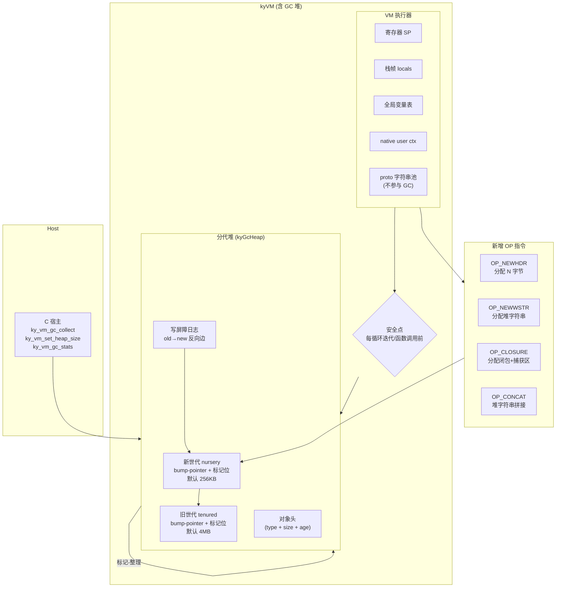

# kyx 分代垃圾回收 · 设计

Feature Name: kyx-gc
Updated: 2026-09-17

## Description

为 kyx VM 引入分代垃圾回收（generational GC），管理脚本层堆对象。设计采用 Node.js 风格：增量式自动触发 + 宿主手动兜底，支持堆字符串、动态数组、闭包捕获三大类 GC 对象。

## Architecture



## 设计决策

| 决策 | 选择 | 理由 |
|------|------|------|
| GC 算法 | 分代标记-整理（STW） | 比引用计数简单（无循环泄漏），比纯增量分代实现代价低；STW 对 kyx 脚本量级（< 100ms/次）可接受 |
| 堆布局 | bump-pointer 连续内存池 | 4 MB 旧世代上限，标记-整理实现 O(1) 分配，无需对象链表元数据 |
| 字符串 | 堆化（完整方案） | 支持 `OP_CONCAT` 结果存全局、动态拼接，无界字符串常量池 |
| 安全点 | 每循环迭代/函数调用前检查 | 响应最及时，开销为一次标志位读取，可忽略 |
| 晋升 | 对象 age 计数，age >= 3 晋升 | 典型对象生命周期 ~3 次 GC，与 V8 经验值一致 |
| 写屏障 | 记录 old→new 反向边 | 新世代 GC 时沿反向边拉旧世代指针，避免漏标 |
| native user ctx | GC 根（weak 标记） | native 函数运行期间 GC 不得回收 user 指向对象 |
| GC 自动阈值 | nursery 已用 >= 容量 | 可配 0 = 禁用自动 |
| 手动 GC | 宿主 `ky_vm_gc_collect` | 在下一个安全点执行，不中断寄存器状态 |

## Components

### 1. `kyGcHeap`（src/script/gc.h / gc.c）

```c
typedef enum KyGcObjType {
    KY_GC_OBJ_STRING = 0,  /* { type, size, age, char* data } */
    KY_GC_OBJ_ARRAY,       /* { type, size, age, kyValue* elems } */
    KY_GC_OBJ_CLOSURE,     /* { type, size, age, kyProto*, kyValue* upvals } */
    KY_GC_OBJ_HEADER,      /* { type, size, age, user_data } */
} kyGcObjType;

typedef struct KyGcObject {
    uint32_t  type : 8;
    uint32_t  size : 24;
    uint32_t  age : 4;     /* 晋升计数，>= 3 时迁移到旧世代 */
    uint32_t  marked : 1;
    uint32_t  next_off : 27; /* 标记-整理时用于链接同世代链表 */
    uint8_t   data[0];    /* 柔性数组，按 type 解释 */
} kyGcObject;

typedef struct KyGcHeap {
    /* 新世代 */
    uint8_t  *nursery;
    uint32_t  nursery_size;
    uint32_t  nursery_used;
    /* 旧世代 */
    uint8_t  *tenured;
    uint32_t  tenured_size;
    uint32_t  tenured_used;
    /* 写屏障日志 */
    uint8_t **barrier_log;
    uint32_t  barrier_count;
    uint32_t  barrier_cap;
    /* 统计 */
    uint64_t  gc_count_n;
    uint64_t  gc_count_t;
    uint64_t  freed_bytes;
    uint64_t  nursery_degraded;
    int       last_gc_time_ms;
    int       auto_disabled;
    /* 配置 */
    uint32_t  nursery_trigger;   /* 0 = 禁用自动 */
} KyGcHeap;
```

### 2. `kyVM` 扩展（vm.c）

```c
typedef struct kyVM {
    /* ... 现有字段 ... */
    KyGcHeap gc;          /* 分代堆 */
    /* GC 根 */
    void *gc_roots[KY_MAX_GC_ROOTS]; /* 宿主登记的 GC 根指针 */
    int    gc_root_count;
} kyVM;
```

### 3. 新增 OP 指令（op 编码 80~84）

| 指令 | 参数 | 行为 |
|------|------|------|
| `OP_NEWHDR` (80) | A=dest, B=byte_len | 在 nursery 分配 B 字节（16 字节对齐），写入 GC 堆指针到寄存器 A |
| `OP_NEWWSTR` (81) | A=dest, B=const_idx, C=const_idx2 | 在 nursery 分配拼接字符串（两个常量 pool 字符串，结果可赋值给全局） |
| `OP_CONCAT` (82) | A=dest, B=str_reg, C=str_reg2 | 拼接两个堆字符串，结果写入 nursery 新对象 |
| `OP_CLOSURE` (83) | A=dest, B=proto_idx, C=upval_count | 在 nursery 分配闭包 + 捕获区，写入 GC 堆指针 |
| `OP_ARRAY` (84) | A=dest, B=elem_count | 在 nursery 分配 kyValue 数组，写入 GC 堆指针 |

### 4. 安全点插入（vm.c 执行循环）

```c
/* 在 while(pc) 循环顶部，每条循环迭代 / 函数调用前 */
if (vm->gc.nursery_used >= vm->gc.nursery_trigger && !vm->gc.auto_disabled)
    ky_gc_run_nursery(vm);
if (vm->gc_collect_requested)
    ky_gc_run_full(vm);
```

### 5. kyValue STRING 表示变更

```c
/* 现有：const char *sval（指向 proto pool，不参与 GC） */
/* 新增：sval 指向 GC 堆 kyGcObject(KY_GC_OBJ_STRING).data */
/* 判定：通过 vm->gc 的指针范围判断是否 GC 堆字符串 */
```

kyValue 结构不变，`as.sval` 指针语义扩展：
- 指向 `proto->strings[]` → 非 GC 字符串
- 指向 `gc.nursery` / `gc.tenured` 内 → GC 堆字符串

### 6. 宿主 API（script.h 扩展）

```c
typedef struct KyGcStats {
    uint32_t nursery_used_bytes;
    uint32_t nursery_capacity_bytes;
    uint32_t tenured_used_bytes;
    uint32_t tenured_capacity_bytes;
    uint64_t total_gc_count;
    uint64_t total_t_gen_gc_count;
    uint64_t total_freed_bytes;
    uint64_t nursery_degraded_count;
    int      last_gc_time_ms;
    int      auto_disabled;
} KyGcStats;

KY_API int    ky_vm_set_heap_size(kyVM *vm, uint32_t nursery_bytes, uint32_t tenured_bytes);
KY_API size_t ky_vm_gc_collect(kyVM *vm);
KY_API int    ky_vm_gc_stats(kyVM *vm, KyGcStats *out);
KY_API int    ky_vm_gc_mark(kyVM *vm, void *ptr);       /* 登记 GC 根 */
KY_API int    ky_vm_gc_unmark(kyVM *vm, void *ptr);
KY_API int    ky_vm_gc_set_auto_threshold(kyVM *vm, uint32_t trigger_bytes); /* 0=禁用 */
```

## Data Models

### kyGcObject 布局（16 字节对齐）

```
offset 0:  type(4) | size(4) | age(4) | marked(4)  -- 4 个 uint32 = 16B header
offset 16: data[]（按 type 解释）
  - STRING: char* data
  - ARRAY:  kyValue* elems (heap-allocated inline)
  - CLOSURE: kyProto* proto, kyValue* upvals
  - HEADER: user bytes
```

### 分配对齐

所有对象分配 16 字节对齐；nursery/tenured 的 `used` 指针维护对齐。

## Correctness Properties

| 不变式 | 保证 |
|--------|------|
| 可达性 | GC 只回收从所有根不可达的对象；根 = 寄存器 SP、栈帧 locals、全局变量表、native user ctx、宿主 gc_roots |
| 写屏障 | 新世代 GC 前，`barrier_log` 中所有 old→new 反向边的 new 端必须被标记 |
| 晋升单调性 | 对象 age 只增不减；age >= 3 且旧世代有空间时晋升 |
| 对齐 | nursery_used / tenured_used 始终 16 字节对齐 |
| native 期间安全 | native 函数执行期间，GC 不回收该函数 user 指向的任何对象（user 指针在 OP_NATIVECALL 前加入 GC 根） |
| 无泄漏 | `ky_vm_destroy` 释放全部堆内存，ASan 无泄漏报告 |

## Error Handling

| 场景 | 行为 |
|------|------|
| nursery/tenured `malloc` 失败 | 在目标寄存器写入 nil，设 `vm->error_msg = "gc alloc failed"`，VM 继续运行 |
| OP_NEWHDR 分配失败（GC 后仍不足） | 目标寄存器 nil，不崩溃 |
| 旧世代 75% 触发 | 触发全堆标记-整理，不降级 |
| 新世代降级（旧世代满） | 存活对象保留在新世代，`nursery_degraded_count++` |
| 自动 GC 禁用（threshold=0） | 跳过自动触发，宿主必须手动调用 `ky_vm_gc_collect` |
| 宿主在 VM 运行中调用 `ky_vm_gc_collect` | 设 `gc_collect_requested=1`，下一个安全点执行 |

## Test Strategy

新文件：`tests/test_kyx_gc.c`，覆盖 R1~R5 全部验收场景，共 20+ 断言。

| 测试场景 | 验收项 |
|----------|--------|
| `ky_vm_create` 后堆已初始化 | R1.1 |
| `ky_vm_set_heap_size` 调整阈值 | R1.1 |
| 堆字符串通过 `OP_NEWWSTR` 分配可 GC | R1.2, R3.1 |
| 堆满触发 nursery GC，存活对象晋升 | R1.3, R2.2 |
| 旧世代 75% 触发全堆 GC | R2.3 |
| `ky_vm_gc_collect` 返回释放字节数 | R1.8, R2.4 |
| 写屏障日志正确性 | R4.1 |
| `ky_vm_gc_mark` 保护宿主指针 | R4.4 |
| 闭包捕获区 GC 回收 | R5.3 |
| `ky_vm_destroy` 无 ASan 泄漏 | R8 |

## References

[^1]: `src/script/vm.c` — VM 执行循环、现有 OP 指令
[^2]: `src/script/script.c` — lexer/parser
[^3]: `include/kronyx/script.h` — 对外 API 头文件
[^4]: `src/script/bindings.c` — native 函数注册
[^5]: `tests/test_kyx_bindings.c` — 既有测试模式参考
