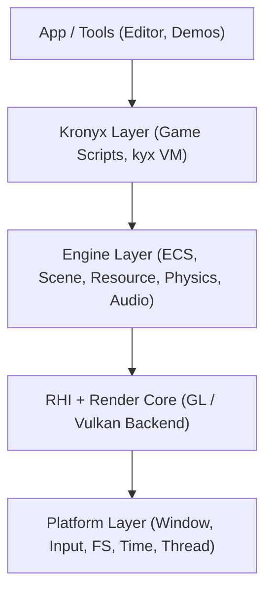
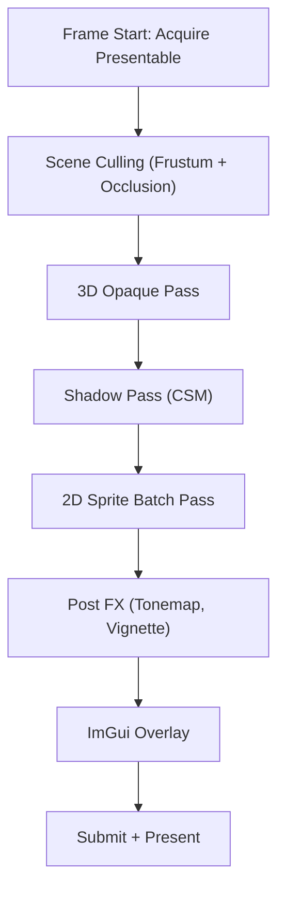
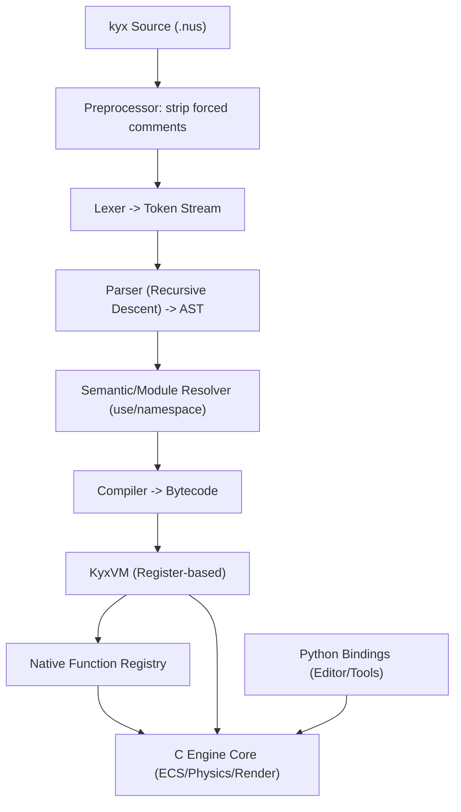
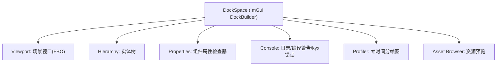

# Kronyx 游戏引擎架构设计白皮书

> 版本：v1.0
> 作者：Kronyx 首席架构师
> 状态：设计定稿，供工程实施参考

---

## 目录

1. [项目概述与设计理念](#1-项目概述与设计理念)
2. [总体架构与模块划分](#2-总体架构与模块划分)
3. [核心类/接口定义（C 面向对象模拟）](#3-核心类接口定义c-面向对象模拟)
4. [核心运行时](#4-核心运行时)
5. [图形渲染模块](#5-图形渲染模块)
6. [物理引擎](#6-物理引擎)
7. [脚本系统概览](#7-脚本系统概览)
8. [Kronyx 脚本语言规范与实现](#8-kronyx-脚本语言规范与实现)
9. [Python 绑定与工具链](#9-python-绑定与工具链)
10. [GUI 编辑器](#10-gui-编辑器)
11. [构建系统](#11-构建系统)
12. [示例游戏](#12-示例游戏)
13. [编译与集成说明](#13-编译与集成说明)
14. [开发路线图](#14-开发路线图)
15. [关键技术决策汇总](#15-关键技术决策汇总)

---

## 1. 项目概述与设计理念

### 1.1 项目定位

Kronyx 是一款**跨平台、面向数据、可嵌入脚本**的游戏引擎，支持 2D 与 3D 图形渲染，内置物理引擎与脚本系统，并配备图形化编辑器面板（场景编辑、属性检查、调试控制台、性能监控）。目标平台为 Windows、Linux、macOS。

Kronyx 的独特之处在于其**原生脚本语言**：引擎内置了名为 Kronyx（简称 **kyx**）的语言。kyx 采用类 Java 的控制流语法，带有一个"可插入任意位置且不影响语义"的**强制注释**机制，通过自定义虚拟机（KyxVM）执行，并与 C 核心通过稳定的 ABI 交互。

### 1.2 设计理念

1. **C 核心，双脚本入口**：引擎核心使用 C11 编写，追求可移植性与可嵌入性。游戏逻辑可用原生 kyx 编写（性能路径），编辑器自动化与工具链脚本使用 Python（便利路径）。
2. **数据驱动与 ECS**：场景对象采用 ECS（Entity-Component-System）模型，组件为纯数据（POD），系统以批次迭代，配合 archetype 内存布局，充分发挥缓存局部性。
3. **后端抽象，一次编写多端渲染**：渲染层基于 RHI（Render Hardware Interface）抽象，实现 OpenGL 3.3 Core 与 Vulkan 1.2 两个后端，2D/3D 共用同一套管线描述。
4. **固定时间步长模拟**：物理与游戏逻辑在固定时间步内模拟，渲染按显示刷新率插值，保证确定性（determinism），便于回放与联机同步。
5. **确定性优先的物理**：内置刚体物理，半隐式欧拉积分 + 冲量约束求解器，broadphase 用 SAP，narrowphase 用 GJK/EPA 与基本图元碰撞。
6. **资源即流水线**：所有资源（纹理、网格、着色器、场景）通过统一资源管理器加载，支持异步加载与热重载。
7. **脚本与引擎双向交互**：kyx 通过注册表调用 C 原生函数；C 亦可将引擎实体句柄安全下放到 kyx，由 kyx 直接驱动游戏逻辑。一切交互经过值封送（marshaling）层，杜绝指针裸露。

### 1.3 关键决策速览

| 决策点 | 选择 | 理由 |
| --- | --- | --- |
| 核心语言 | C11 | 可移植性、嵌入性、ABI 稳定，避免 C++ ABI 跨平台问题 |
| 渲染后端 | OpenGL 3.3 Core + Vulkan 1.2（RHI 抽象） | GL 保底全平台，Vulkan 追求高性能，共享上层描述 |
| 脚本语言 | 自研 kyx（原生）+ Python（工具） | 游戏逻辑免编译热更、零依赖；Python 服务编辑器生态 |
| 物理引擎 | 自研刚体物理 | 满足"内置物理引擎"定位，可深度定制与确定性控制 |
| GUI | Dear ImGui | 即时模式、零 GC、渲染后端复用现有 RHI，迭代极快 |
| 构建系统 | CMake + FetchContent | 三平台通用，依赖管理内聚 |
| 内存管理 | 核心区域内存池 + 脚本 GC | 核心可控，脚本免悬挂指针负担 |

---

## 2. 总体架构与模块划分

### 2.1 分层架构



### 2.2 模块清单

| 模块 | 路径（建议） | 职责 |
| --- | --- | --- |
| `ky_platform` | `src/platform/` | 窗口（GLFW）、输入、文件系统、高精度时钟、线程池、动态库加载 |
| `ky_core` | `src/core/` | 数学库（向量/矩阵/四元数）、内存分配器、动态数组/哈希表/字符串、日志、断言 |
| `ky_ecs` | `src/ecs/` | 实体句柄、组件类型注册、archetype 存储、系统调度 |
| `ky_scene` | `src/scene/` | 场景图、层级关系、变换、序列化（二进制+JSON） |
| `ky_resource` | `src/resource/` | 资源注册、异步加载、引用计数、热重载、资产导入管线 |
| `ky_render` | `src/render/` | RHI 抽象、场景渲染（2D 批次 / 3D 前向+）、着色器管理、光照阴影 |
| `ky_backend_gl` | `src/render/gl/` | OpenGL 3.3 Core 后端实现 |
| `ky_backend_vk` | `src/render/vk/` | Vulkan 1.2 后端实现 |
| `ky_physics` | `src/physics/` | 刚体、碰撞体、broadphase/narrowphase、约束求解、CCD |
| `ky_script` | `src/script/` | kyx 词法/语法/编译/VM、值封送、原生函数注册表 |
| `ky_python` | `src/python/` | 基于 CPython C API 的 Python 绑定（工具层） |
| `ky_editor` | `tools/editor/` | ImGui 编辑器：视口、层级、属性、控制台、性能面板 |
| `ky_audio` | `src/audio/` | 简化音频播放（miniaudio 封装），后续阶段 |
| `tests/` | `tests/` | 单元测试（core、ecs、render 描述、physics、script） |
| `demos/` | `demos/` | 示例游戏：2D 平台跳跃、3D 漫游 |

### 2.3 模块依赖规则

- **单向依赖**：`platform ← core ← ecs/scene/resource ← render/physics/script ← editor/demos`。
- 上层模块只允许依赖下层与同层，禁止反向依赖。
- `render`、`physics`、`script` 之间**不互相依赖**，通过 `scene` 层的组件与系统解耦（如脚本组件驱动刚体组件，均由系统调度，而非直接调用）。

---

## 3. 核心类/接口定义（C 面向对象模拟）

C 语言没有类，Kronyx 采用 **结构体（数据）+ 函数指针（虚表）+ 前缀命名（方法）** 的约定模拟 OOP。所有跨模块交互均通过不透明指针（opaque handle）完成，头文件只暴露 `typedef struct kyXxx kyXxx;` 与函数签名。

### 3.1 对象模型约定

```c
// 所有可派生对象以 "基底" 开头，派生对象将基底的 vtable 放在结构体首字段
typedef struct kyObject {
    const struct kyObjectVtbl *vtbl;  // 虚函数表，首字段保证可向上转型
    int32_t ref_count;                 // 引用计数（工具层）或 0（无 GC）
} kyObject;

typedef struct kyObjectVtbl {
    void (*destroy)(kyObject *self);
} kyObjectVtbl;
```

### 3.2 引擎上下文与生命周期

```c
typedef struct kyEngineConfig {
    const char *app_name;
    uint16_t window_width;
    uint16_t window_height;
    int vsync;
    uint8_t log_level;
    struct {
        int backend;            // KY_RENDERER_GL 或 KY_RENDERER_VULKAN
        int width, height;
    } render;
    int python_enabled;         // 是否初始化 CPython（仅编辑器/工具构建）
} kyEngineConfig;

typedef struct kyEngine kyEngine;

KY_API kyEngine *ky_engine_create(const kyEngineConfig *cfg);
KY_API void       ky_engine_destroy(kyEngine *engine);
KY_API int        ky_engine_run(kyEngine *engine);          // 阻塞式主循环
KY_API void       ky_engine_stop(kyEngine *engine);         // 请求退出
KY_API float      ky_engine_frame_time(const kyEngine *engine);
KY_API int        ky_engine_is_running(const kyEngine *engine);
```

### 3.3 数学库

```c
typedef struct { float x, y; }          kyVec2;
typedef struct { float x, y, z; }       kyVec3;
typedef struct { float x, y, z, w; }    kyVec4;
typedef struct { float x, y, z, w; }    kyQuat;   // 四元数，w 为实部
typedef struct { float m[16]; }         kyMat4;   // 列主序，与 GLSL/SPIR-V 对齐
typedef struct { kyVec3 center; float radius; } kySphere;
typedef struct { kyVec3 min, max; }             kyAABB;

KY_API kyMat4 ky_mat4_identity(void);
KY_API kyMat4 ky_mat4_translate(kyVec3 t);
KY_API kyMat4 ky_mat4_rotate(kyQuat q);
KY_API kyMat4 ky_mat4_perspective(float fovy_rad, float aspect, float zn, float zf);
KY_API kyMat4 ky_mat4_look_at(kyVec3 eye, kyVec3 center, kyVec3 up);
KY_API kyMat4 ky_mat4_mul(const kyMat4 *a, const kyMat4 *b);
```

### 3.4 ECS 核心接口

```c
typedef struct kyEntity {
    uint32_t id;        // 实体槽位索引
    uint32_t version;   // 世代号，防止悬垂句柄复用
} kyEntity;

#define KY_NULL_ENTITY ((kyEntity){0, 0})

typedef struct kyComponentType {
    const char *name;
    size_t size;                        // 组件字节大小（POD）
    uint32_t type_id;                   // 注册时分配
    void (*ctor)(void *comp);
    void (*dtor)(void *comp);
    void (*on_add)(kyEntity e, void *comp);     // 可选回调
} kyComponentType;

typedef struct kySystem {
    const char *name;
    uint32_t order;                     // 调度顺序，小者先执行
    const uint32_t *reads;              // 依赖的组件 type_id 数组
    const uint32_t *writes;
    size_t read_count, write_count;
    void (*update)(struct kyWorld *w, float dt, void *user);
    void *user;
} kySystem;

typedef struct kyWorld kyWorld;

KY_API kyWorld *ky_world_create(void);
KY_API void     ky_world_destroy(kyWorld *w);
KY_API uint32_t ky_world_register_component(kyWorld *w, const kyComponentType *t);
KY_API void     ky_world_register_system(kyWorld *w, const kySystem *s);
KY_API kyEntity ky_world_spawn(kyWorld *w);
KY_API void     ky_world_despawn(kyWorld *w, kyEntity e);
KY_API void    *ky_world_add_component(kyWorld *w, kyEntity e, uint32_t type_id);
KY_API void    *ky_world_get_component(kyWorld *w, kyEntity e, uint32_t type_id);   // 无则 NULL
KY_API void     ky_world_remove_component(kyWorld *w, kyEntity e, uint32_t type_id);
KY_API void     ky_world_step(kyWorld *w, float dt);  // 按 order 依次执行已注册系统
KY_API int      ky_entity_valid(const kyWorld *w, kyEntity e);
```

### 3.5 资源管理器

```c
typedef enum kyResourceKind { KY_RES_MESH, KY_RES_TEXTURE, KY_RES_SHADER, KY_RES_MATERIAL, KY_RES_SCENE, KY_RES_AUDIO } kyResourceKind;

typedef struct kyResource {
    kyResourceKind kind;
    uint64_t id;                // 哈希后的资源 GUID
    char path[512];
    int32_t ref_count;
    void (*reload)(struct kyResource *r);   // 热重载入口
} kyResource;

typedef struct kyResourceManager kyResourceManager;

KY_API kyResourceManager *ky_resmgr_create(void);
KY_API kyResource *ky_resmgr_load(kyResourceManager *m, const char *path);      // 同步加载
KY_API void       ky_resmgr_load_async(kyResourceManager *m, const char *path, void (*cb)(kyResource*, void*), void *user);
KY_API void       ky_resmgr_acquire(kyResourceManager *m, kyResource *r);       // +1 引用
KY_API void       ky_resmgr_release(kyResourceManager *m, kyResource *r);       // -1 引用，归零释放
KY_API void       ky_resmgr_hot_reload(kyResourceManager *m, const char *path);
```

### 3.6 渲染核心接口（RHI 抽象）

```c
typedef enum kyRendererBackend { KY_RENDERER_NONE = 0, KY_RENDERER_GL, KY_RENDERER_VULKAN } kyRendererBackend;
typedef enum kyShaderStage  { KY_STAGE_VERTEX = 0, KY_STAGE_FRAGMENT, KY_STAGE_COMPUTE } kyShaderStage;
typedef enum kyPrimitiveTopology { KY_TRIANGLES, KY_TRIANGLE_STRIP, KY_LINES, KY_POINTS } kyPrimitiveTopology;

typedef struct kyRenderDevice  kyRenderDevice;   // 后端设备（GL context / VkDevice 包装）
typedef struct kyShader         kyShader;
typedef struct kyBuffer         kyBuffer;
typedef struct kyTexture        kyTexture;
typedef struct kyPipeline       kyPipeline;
typedef struct kyCommandList    kyCommandList;

typedef struct kyShaderSource {
    const char *vs;              // GLSL 源码（后端统一以 GLSL 为入口）
    const char *fs;
    const char *cs;              // 可选 compute
    const char *entry;           // 默认 "main"
} kyShaderSource;

typedef struct kyVertexAttrib { uint32_t location; uint32_t offset; uint32_t size; uint8_t normalized; } kyVertexAttrib;
typedef struct kyVertexLayout { const kyVertexAttrib *attribs; uint32_t count; uint32_t stride; } kyVertexLayout;

KY_API kyRenderDevice *ky_rd_create(kyRendererBackend backend, void *platform_win);
KY_API void            ky_rd_destroy(kyRenderDevice *rd);
KY_API const char     *ky_rd_backend_name(const kyRenderDevice *rd);

KY_API kyShader   *ky_rd_create_shader(kyRenderDevice *rd, const kyShaderSource *src);
KY_API kyBuffer   *ky_rd_create_buffer(kyRenderDevice *rd, size_t size, const void *data, int dynamic);
KY_API kyTexture  *ky_rd_create_texture_2d(kyRenderDevice *rd, int w, int h, int channels, const void *pixels);
KY_API kyPipeline *ky_rd_create_pipeline(kyRenderDevice *rd, const kyPipelineDesc *desc);

KY_API kyCommandList *ky_rd_begin(kyRenderDevice *rd);
KY_API void           ky_cmd_set_pipeline(kyCommandList *cl, kyPipeline *p);
KY_API void           ky_cmd_set_const(kyCommandList *cl, int slot, const void *data, size_t bytes);
KY_API void           ky_cmd_set_vertex_buffer(kyCommandList *cl, kyBuffer *vb, uint32_t stride);
KY_API void           ky_cmd_set_index_buffer(kyCommandList *cl, kyBuffer *ib, uint32_t index_size);
KY_API void           ky_cmd_set_texture(kyCommandList *cl, int slot, kyTexture *tex);
KY_API void           ky_cmd_draw_indexed(kyCommandList *cl, uint32_t index_count, uint32_t instance_count);
KY_API void           ky_rd_submit(kyRenderDevice *rd, kyCommandList *cl);
KY_API void           ky_rd_present(kyRenderDevice *rd);
```

### 3.7 物理引擎接口

```c
typedef enum kyColliderShape { KY_SHAPE_SPHERE, KY_SHAPE_BOX, KY_SHAPE_CAPSULE, KY_SHAPE_PLANE, KY_SHAPE_CONVEX_MESH, KY_SHAPE_TRI_MESH } kyColliderShape;

typedef struct kyCollider {
    kyColliderShape shape;
    union {
        kySphere sphere;
        struct { kyVec3 half_extents; } box;
        struct { float radius, half_height; } capsule;
        struct { kyVec3 normal; float d; } plane;
    } u;
} kyCollider;

typedef struct kyRigidBody {
    kyVec3   position;
    kyQuat   rotation;
    kyVec3   linear_velocity;
    kyVec3   angular_velocity;
    float    inv_mass;              // 0 = 静态
    float    inv_inertia[3];        // 对角线逆惯性张量（局部系）
    float    restitution;           // 弹性系数 [0,1]
    float    friction;              // 摩擦系数
    uint32_t collider_id;           // 关联碰撞体
    uint32_t flags;                 // 睡眠/激活/CCD 标志
    void    *user_data;
} kyRigidBody;

typedef struct kyPhysicsWorld kyPhysicsWorld;

KY_API kyPhysicsWorld *ky_physics_create(kyVec3 gravity);
KY_API void            ky_physics_destroy(kyPhysicsWorld *pw);
KY_API uint32_t        ky_physics_add_collider(kyPhysicsWorld *pw, const kyCollider *c);
KY_API uint32_t        ky_physics_add_body(kyPhysicsWorld *pw, const kyRigidBody *b);
KY_API void            ky_physics_set_gravity(kyPhysicsWorld *pw, kyVec3 g);
KY_API void            ky_physics_step(kyPhysicsWorld *pw, float dt);          // 固定步长调用
KY_API void            ky_physics_apply_impulse(kyPhysicsWorld *pw, uint32_t body, kyVec3 impulse, kyVec3 at);
KY_API void            ky_physics_get_body(kyPhysicsWorld *pw, uint32_t body, kyRigidBody *out);
KY_API void            ky_physics_cast_ray(kyPhysicsWorld *pw, kyVec3 origin, kyVec3 dir, float max_t, kyRayHit *out_hit);
```

### 3.8 脚本引擎接口（C 侧）

```c
typedef enum kyValueType { KY_NIL, KY_BOOL, KY_INT, KY_FLOAT, KY_STRING, KY_FUNCTION, KY_CLASS, KY_INSTANCE, KY_NATIVE, KY_ARRAY } kyValueType;

typedef struct kyValue {
    kyValueType type;
    union {
        int    b;
        int64_t i;
        double f;
        const char *s;      // 指向 VM 内字符串（GC 管理）
        struct kyFunction *fn;
        struct kyInstance *inst;
        void *native;       // 原生句柄（封装指针 + 释放器）
    } as;
} kyValue;

typedef struct kyVM kyVM;
typedef kyValue (*kyNativeFn)(kyVM *vm, kyValue *args, int argc, void *user);

KY_API kyVM   *ky_vm_create(const struct kyVMCreateInfo *info);   // 含 import 搜索路径配置
KY_API void    ky_vm_destroy(kyVM *vm);
KY_API int     ky_vm_load_string(kyVM *vm, const char *src, const char *name);   // 编译+执行，0 成功
KY_API int     ky_vm_load_file(kyVM *vm, const char *path);
KY_API int     ky_vm_call(kyVM *vm, const char *func_name, kyValue *args, int argc, kyValue *ret);
KY_API void    ky_vm_register_native(kyVM *vm, const char *ns, const char *name, kyNativeFn fn, void *user);
KY_API const char *ky_vm_last_error(kyVM *vm);   // 含行号与堆栈的格式化错误
KY_API void    ky_vm_set_import_root(kyVM *vm, const char *dir);   // local 导入的根路径
```

### 3.9 编辑器/工具层公共接口

```c
typedef struct kyEditorHooks {
    void (*draw_viewport)(void);        // 由 RHI 渲染场景到 FBO
    void (*on_select)(kyEntity e);
    void (*on_property_changed)(kyEntity e, const char *comp, const char *field);
    void (*log)(int level, const char *msg);
} kyEditorHooks;

void ky_editor_run(kyEngine *engine, const kyEditorHooks *hooks);
```

---

## 4. 核心运行时

### 4.1 引擎主循环

采用**固定时间步长 + 渲染插值**模型。`ky_engine_run` 内部结构如下：

```c
static int run_loop(kyEngine *e) {
    const float fixed_dt = 1.0f / 60.0f;
    float accumulator = 0.0f;
    while (ky_engine_is_running(e)) {
        double now  = ky_time_now();
        double frame = now - e->last_frame;
        e->last_frame = now;
        accumulator = fminf(accumulator + (float)frame, 0.25f);   // 防螺旋死亡

        ky_platform_poll_events(e->window);
        while (accumulator >= fixed_dt) {
            ky_script_on_fixed_update(e->vm, fixed_dt);   // kyx 固定更新（先）
            ky_ecs_step(e->world, fixed_dt);              // 系统调度（物理系统在列）
            accumulator -= fixed_dt;
        }
        const float alpha = accumulator / fixed_dt;       // 插值因子

        ky_render_scene(e->rd, e->scene, alpha);          // 渲染（帧率独立）
        ky_render_present(e->rd);
    }
    return 0;
}
```

设计理由：
- 固定步长保证物理与 kyx 逻辑**确定性**，回放/断点调试可复现。
- `accumulator` 封顶 250ms，避免长时间卡顿后的"死亡螺旋"。
- alpha 插值用于刚体位置在渲染时的平滑，仅在渲染层使用，不污染模拟状态。

### 4.2 ECS 实现方案

采用 **Archetype（原型）+ Sparse Set** 存储：

```c
typedef struct kyArchetype {
    uint32_t *component_types;     // 升序 type_id 数组
    size_t     component_count;
    size_t     entity_count;
    size_t     capacity;
    struct {
        uint8_t *data;             // 该列的组件数组
        uint32_t type_id;
        size_t   stride;
    } *columns;
    uint32_t *entity_ids;          // 实体 id 映射（sparse 用）
} kyArchetype;
```

- 每个组件集（如 `{Transform, RigidBody}`、`{Transform, Sprite}`）对应一个 archetype，组件按列连续存储，系统迭代时对列做顺序扫描，命中缓存。
- 实体 id 使用 sparse-set 映射到 archetype 槽位；销毁时以 swap-remove 保持紧凑。
- 组件增删会触发实体在 archetype 之间迁移；迁移频率低（运行时很少改变组件集），代价可接受。
- 查询接口 `ky_world_view(w, types[], n)` 返回只读迭代器，供系统使用。

### 4.3 场景管理

- 场景 = 实体 + 组件 + 资源引用 + 场景元数据（光照、环境、脚本挂载点）。
- 场景序列化采用**自定义二进制格式（.kyscene）+ 可选 JSON**：二进制用于运行时快速加载，JSON 用于编辑器 diff/手改。
- 场景中的 kyx 脚本以 `ScriptSource` 组件引用，运行时由脚本系统编译为字节码并缓存。

### 4.4 资源加载与热重载

- 所有资源统一 `kyResource` 头 + 引用计数。
- 异步加载：后台线程解析文件 → 主线程创建 GPU 资源，通过任务队列回传完成回调。
- 热重载：文件系统监视器（简单轮询或 inotify/ReadDirectoryChangesW）检测到着色器/脚本/纹理变更时，触发 `reload` 回调并失效缓存；编辑器下默认开启。

---

## 5. 图形渲染模块

### 5.1 RHI 与后端选型

- 上层渲染器只面向 `kyRenderDevice`/`kyCommandList` 抽象。
- **OpenGL 3.3 Core**：跨平台保底，桌面全覆盖，调试便利。
- **Vulkan 1.2**：高性能路径，支持显式资源管理与多线程命令录制。
- 着色器以 **GLSL 为源语言**：GL 后端直接编译；Vulkan 后端经 `glslangValidator` 交叉编译为 SPIR-V（构建期或运行时缓存）。

### 5.2 渲染流程（帧）



### 5.3 2D 渲染

- **批次化**：所有 2D 精灵、图集、文本合并进一个动态顶点缓冲（Streaming VB），按纹理排序后单次 DrawCall。
- 每帧 1~3 个 DrawCall 渲染全场景精灵，适合横版平台跳跃类游戏。
- 2D 相机 = 正交投影矩阵 + 变换。

### 5.4 3D 渲染

- 采用**前向渲染 + Forward+ 光加速**（首版简化：单灯光直射 + 最多 8 点光，直接 UB 传递）。
- 管线：顶点输入 → 材质（BaseColor/Normal/Metallic-Roughness）→ 环境光（IBL 简化版）→ 方向光阴影。
- 阴影：方向光使用 **CSM（Cascaded Shadow Map）**，2~3 级级联，PCF 4-tap 软阴影；点光可选 6 面 cubemap 阴影（后期）。

### 5.5 着色器管理

```c
typedef struct kyShaderUniformDesc {
    const char *name;
    uint32_t    stage;
    uint32_t    binding;    // UB slot 或 descriptor binding
    size_t      size;
} kyShaderUniformDesc;

typedef struct kyPipelineDesc {
    kyShader            *shader;
    kyVertexLayout       layout;
    kyPrimitiveTopology  topology;
    int depth_test, depth_write, cull_mode;
    struct { int on; kyVec4 color; } blend;
} kyPipelineDesc;
```

- 着色器编译产物缓存至 `cache/shaders/<hash>.spv`（Vulkan）或缓存二进制（GL，可选）。
- 材质 = `kyMaterial { kyPipeline*, kyShaderParams, kyTexture* slots[8] }`。

### 5.6 网格与纹理

```c
typedef struct kyMeshData {
    kyBuffer *vb, *ib;
    uint32_t vertex_count, index_count;
    kyVertexLayout layout;
    kyAABB bounds;           // 供剔除使用
} kyMeshData;
```

- 顶点格式：位置(float3)、法线(float3)、切线(float4)、UV(float2)、顶点色(float4)，interleave 存储。
- 纹理管线：stb_image 解码 → GPU 上传；支持 sRGB 采样、mipmap 生成、压缩格式（BC/ASTC 视平台，首版不做）。

---

## 6. 物理引擎

### 6.1 总体设计

内置自研物理引擎，面向"确定性、简单、够用"原则，覆盖 2D/3D 刚体需求。不做布料/流体（预留扩展接口）。

### 6.2 管线（每固定步）

1. **积分**：半隐式欧拉，先更新速度（含重力），再更新位置。
   ```
   v += g * dt + invM * F_ext * dt
   x += v * dt
   ω += I_inv * (τ - ω × I·ω) * dt
   q += 0.5 * ω_q * q * dt  （四元数导数），随后归一化
   ```
2. **Broadphase**：SAP（Sweep and Prune）按 AABB 三个轴排序扫描，输出候选对。
3. **Narrowphase**：按碰撞体形状分派——球-球、球-箱、箱-箱走 SAT；凸体通用走 **GJK 求碰撞 + EPA 求穿透**；三角网格走 Minkowski 边界采样（简化）。
4. **碰撞响应**：冲量法。对每对碰撞求法向冲量 `j`，满足动量守恒与恢复系数：
   ```
   j = -(1+e) * v_rel·n / (invM_a + invM_b + (r_a×n)²·I_a⁻¹ + (r_b×n)²·I_b⁻¹)
   ```
   摩擦用 Coulamb 近似：切向冲量 `j_t = -min(|j_t_ideal|, μ*|j_n|)`。
5. **约束求解**：迭代 8~12 次求解接触约束（Projected Gauss-Seidel），保证堆叠稳定。
6. **睡眠管理**：线/角速度低于阈值持续若干帧 → 标记睡眠，参与但跳过积分与求解（岛级休眠，按连通分量划分）。
7. **CCD**：对速度超阈值的刚体做连续碰撞检测（扫掠球 vs 场景），防止隧穿。

### 6.3 关键算法选型

| 需求 | 算法 | 理由 |
| --- | --- | --- |
| 宽相 | SAP | 实现简单、缓存友好、场景规模（<5k 物体）足够 |
| 凸体窄相 | GJK + EPA | 通用性强，支持任意凸体，数值稳定 |
| 堆叠稳定 | PGS 迭代求解 | 简单可控，确定性好 |
| 快速物体 | 扫掠 CCD | 仅对高速体启用，成本可控 |
| 重力 | 用户配置 `kyVec3` | 支持 2D 模式（Z 轴锁死 + 平面引力） |

### 6.4 2D 模式

- 通过约束：锁定 Z 轴线速度与角速度（限制刚体自由度）。
- 碰撞体使用 2D 图元（圆、矩形），复用同一套求解器，仅降维。

---

## 7. 脚本系统概览

### 7.1 体系结构



### 7.2 脚本挂载模型

- 游戏对象通过 `ScriptSource` 组件绑定 kyx 源文件；系统 `ScriptSystem` 每固定步调用约定入口（`on_fixed_update`、`on_begin`、`on_end`）。
- kyx 通过句柄 API 与 ECS 交互：`world.spawn()`, `entity.add_comp(type, args)`, `entity.get("rigidbody").linear_velocity = ...`。
- 原生函数注册表以 `namespace.funcname` 为键；kyx 侧 `use builtin "engine"` 获得整套引擎 API。

### 7.3 与 Python 的关系

- kyx：**运行时游戏逻辑**，性能敏感路径。
- Python：**编辑器脚本/工具链/资产管线**，经 CPython C API 绑定（见第 9 节）。
- 两者不混用：游戏运行时默认不启用 Python（`python_enabled=0`），保证部署产物无解释器依赖。

---

## 8. Kronyx 脚本语言规范与实现

### 8.1 语言设计目标

1. 类 Java 的控制流，C/C++ 程序员零学习成本。
2. **强制注释**机制支持在任意位置插入标记，形成"可注入"的宏/注解变体。
3. 显式模块系统（`use` + 命名空间），自带命名冲突自动重命名与警告。
4. 动态类型 + 面向对象（单继承、方法分派），适合游戏逻辑快速迭代。
5. 编译到自定义寄存器虚拟机字节码，执行效率接近 Lua 5.4 量级。

### 8.2 词法规范

#### 8.2.1 字符集与空白

- 源文件 UTF-8；标识符支持 ASCII 字母、数字、下划线（`[A-Za-z_][A-Za-z0-9_]*`），首字符非数字。
- 空白：空格 ` `、制表符 `\t`、回车 `\r`、换行 `\n` 均视为空白，换行不参与语句终结（类 Java，语句以 `;` 或 `}` 终结）。

#### 8.2.2 注释（三级）

| 类型 | 写法 | 语义 |
| --- | --- | --- |
| 行注释 | `// ...` 至行尾 | 常规 |
| 块注释 | `/* ... */` | 常规，可跨行 |
| **强制注释** | `[/*<!--{任意文本}-->*/]` | 预处理阶段整体剥离，不可换行（行尾 `\` 可续行），出现在任何位置均被忽略 |

#### 8.2.3 强制注释的预处理规则（关键实现）

- 预处理在**词法分析之前**、对**原始文本**执行：线性扫描源文本，一旦命中精确起始序列 `[/*<!--`，则进入"强制注释剥离态"，持续读取直到命中精确结束序列 `-->*/]`。
- 在剥离态内，若遇到换行且该行最后一个字符**不是** `\`（续行符），抛出词法错误（`unterminated forced comment`）。若最后一个字符是 `\`，则删除 `\` 并继续到下一行（续行合并）。
- 因为剥离发生在字符串与普通注释解析之前，所以它**可以在字符串字面量内部、关键字中间、运算符之间**生效：
  - `i[/*<!--{c}-->*/]f(){}` → 剥离后 `if(){}` ✓
  - `console.log("tes[/*<!--{c}-->*/]t")` → 剥离后 `"test"` ✓
  - `a[/*<!--{c}-->*/]+[/*<!--{c}-->*/]b` → `a+b` ✓
- 边界说明：由于是文本级剥离，写在普通 `//` 或 `/* */` 注释内部的强制注释片段同样会被剥离（不影响语义，因为所在行已是注释）；应避免在普通块注释内写未闭合的强制注释序列，否则会触发续行错误——此乃文档约定而非缺陷。

预处理后的产物进入标准词法阶段。

#### 8.2.4 关键字

```
use namespace if else while for break continue return
function fun class var let const true false nil self super new
this import export
```

保留字不可作标识符。

#### 8.2.5 运算符与定界符

```
算术:    + - * / % ++ -- 
比较:    == != < <= > >=
逻辑:    && || !
位运算:  & | ^ ~ << >>
赋值:    = += -= *= /= %= 
定界符:  ( ) { } [ ] . , ; :
```

#### 8.2.6 字面量

| 类别 | 示例 | 说明 |
| --- | --- | --- |
| 整数 | `42` `-7` `0xFF` `0b1010` | 64 位有符号；支持十六进制、二进制 |
| 浮点 | `3.14` `1e-3` `.5` | IEEE754 double |
| 字符串 | `"hello"` `"a\"b"` | 转义 `\n \t \\ \" \u{XXXX}`；**强制注释可在字符串内部被剥离** |
| 布尔 | `true` `false` | |
| 空值 | `nil` | |

### 8.3 语法规范（EBNF 摘要）

```
Program        ::= UseDecl* (VarDecl | FuncDecl | ClassDecl | Stmt)*
UseDecl        ::= 'use' Scope String [ 'namespace' Ident ] ';'
Scope          ::= 'external' | 'builtin' | 'local'

VarDecl        ::= ('var' | 'let' | 'const') Ident [ '=' Expr ] ';'
FuncDecl       ::= 'function' Ident '(' ParamList? ')' Block
ClassDecl      ::= 'class' Ident [ 'extends' Ident ] '{' ClassMember* '}'
ClassMember    ::= (VarDecl | FuncDecl)

Block          ::= '{' Stmt* '}'
Stmt           ::= VarDecl | IfStmt | WhileStmt | ForStmt
                 | ReturnStmt | BreakStmt | ContinueStmt | ExprStmt
IfStmt         ::= 'if' '(' Expr ')' Block [ 'else' (Block | IfStmt) ]
WhileStmt      ::= 'while' '(' Expr ')' Block
ForStmt        ::= 'for' '(' [VarDecl] ';' [Expr] ';' [Expr] ')' Block
ReturnStmt     ::= 'return' [Expr] ';'
ExprStmt       ::= Expr ';'

Expr           ::= AssignExpr
AssignExpr     ::= CondExpr (('=' | '+=' | '-=' | '*=' | '/=' | '%=') AssignExpr)?
CondExpr       ::= OrExpr [ '?' Expr ':' CondExpr ]
OrExpr         ::= AndExpr ('||' AndExpr)*
AndExpr        ::= BitOrExpr ('&&' BitOrExpr)*
BitOrExpr      ::= BitXorExpr ('|' BitXorExpr)*
BitXorExpr     ::= BitAndExpr ('^' BitAndExpr)*
BitAndExpr     ::= EqualityExpr ('&' EqualityExpr)*
EqualityExpr   ::= RelExpr (('==' | '!=') RelExpr)*
RelExpr        ::= ShiftExpr (('<' | '<=' | '>' | '>=') ShiftExpr)*
ShiftExpr      ::= AddExpr (('<<' | '>>') AddExpr)*
AddExpr        ::= MulExpr (('+' | '-') MulExpr)*
MulExpr        ::= UnaryExpr (('*' | '/' | '%') UnaryExpr)*
UnaryExpr      ::= ('!' | '-' | '~' | '++' | '--') UnaryExpr | PostfixExpr
PostfixExpr    ::= Primary ('.' Ident | '[' Expr ']' | '(' Args? ')' | '++' | '--')*
Primary        ::= Literal | Ident | '(' Expr ')'
                 | 'function' '(' ParamList? ')' Block          # 匿名函数/闭包
                 | 'new' Ident '(' Args? ')'
Args           ::= Expr (',' Expr)*
ParamList      ::= Ident (',' Ident)*
```

### 8.4 模块系统（`use` 语句）

#### 8.4.1 语法

```
use <scope> "<path>" [namespace <name>];
```

| scope | path 语义 | 默认命名空间 |
| --- | --- | --- |
| `external` | `"libname:path/to/xxx.nus"`，`libname` 为库标识 | `libname`（冒号前部分） |
| `builtin` | 内置模块名，如 `"stdio"`、`"engine"`、`"math"` | 模块名 |
| `local` | 相对当前文件目录（或 import root）的相对路径 | 文件名（不含目录与扩展名） |

#### 8.4.2 命名冲突处理（编译器行为）

- 编译器维护一张**命名空间符号表** `ns_table: map<ns_name, module_id>`。
- 处理每个 `use` 时：
  1. 解析 path → 定位源码文件 → 编译为独立模块单元（独立作用域）。
  2. 计算目标命名空间名（显式 `namespace` 优先，否则按上表默认）。
  3. 若该命名空间已被占用，则对**后导入者**自动添加前缀 `p_`（`p_another`、`p_another_1` 递推），并在编译输出（stderr / 编辑器控制台）发出警告：
     ```
     warning: namespace 'utils' already in use by module '<other>'; renamed to 'p_utils'
     ```
  4. 编译**继续**，不中断（与规范"命名冲突时警告，但编译继续"一致）。
- 多个文件互相 `use` 的循环依赖：检测 SCC，引用循环时发出错误（`circular import detected`）。

#### 8.4.3 模块解析与缓存

- 外部库搜索路径：`KYX_IMPORT_PATH` 环境变量（`:`/`;` 分隔）+ VM 配置的 `import_roots[]`。
- 已编译模块按 (scope,path) 哈希缓存于 VM，重复 `use` 不重复编译。

### 8.5 类型系统

| 类型 | 说明 |
| --- | --- |
| `nil` | 空值 |
| `bool` | true/false |
| `int` | 64 位有符号整数 |
| `float` | 双精度浮点 |
| `string` | 不可变字节串，UTF-8 |
| `array` | 动态数组，`a[i]`、`a.push(x)` |
| `function` | 一等公民，支持闭包（upvalue） |
| `class` | 单继承；字段 + 方法 |
| `instance` | 类实例；`self` 访问自身 |
| `native` | 不透明原生句柄（引擎对象封装） |

- 弱类型：运算符按运行期类型分派；`int`+`float` 自动提升为 `float`；`nil` 参与比较返回 `false` 或抛运行期错误（取决于操作）。
- 内置方法示例（模块 `engine`）：`engine.world`, `engine.entity_comp`, `engine.math_...`。

### 8.6 编译器实现

#### 8.6.1 词法分析器（Lexer）

- 单遍扫描，输出 `kyToken { kyTokenKind kind; const char *start; size_t len; int line; int col; }`。
- 强制注释已在预处理阶段剥离，词法器不感知。
- 最大吃入（maximal munch）原则：`>>=` 整体为一个 token 而非 `>>`+`=`。

#### 8.6.2 语法分析器（Parser）

- **递归下降 + 优先级爬升（precedence climbing）**处理表达式，文法见 8.3。
- 直接生成 **AST**（`kyAstNode` 变体联合体），随后交由语义分析。

#### 8.6.3 语义分析与模块解析

- 建符号表、解析 `use` 命名空间、检测未定义变量/函数。
- 方法解析：`a.b(...)` → 若 `a` 为已知类实例，直接绑定类方法（快路径）；否则编译为运行期查找（动态分派）。
- 产出"命名空间解析完成"的 AST。

#### 8.6.4 字节码生成（Compiler）

- 遍历 AST 生成指令序列，表达式编译为**栈式求值 → 寄存器分配**：首版采用简单线性分配（Lua 5.3 风格的固定寄存器窗口 + 临时上溢栈）。
- 常量表（int/float/string 去重）、函数原型表、字符串池。

#### 8.6.5 指令集设计（KyVM 字节码）

寄存器虚拟机，每条指令 32 位定长（op 8bit + A 8bit + B 8bit + C 8bit，小参数嵌入；大参数走常量索引）。

```text
-- 核心指令表（节选）
OP_LOADCONST   A B        -- R[A] := Constants[B]
OP_LOADNIL     A          -- R[A] := nil
OP_LOADBOOL    A B        -- R[A] := B
OP_LOADINT     A B        -- R[A] := small int B（内嵌）
OP_MOVE        A B        -- R[A] := R[B]
OP_ADD/SUB/MUL/DIV/MOD   A B C
OP_NEG/BNOT/NOT A B
OP_EQ/NE/LT/LE/GT/GE    A B C        -- R[A] := R[B] op R[C]
OP_AND/OR      A B C
OP_CONCAT      A B C
OP_NEWARRAY    A B        -- R[A] := array, size B
OP_GETFIELD    A B C      -- R[A] := R[B].field C（C=字段名常量索引）
OP_SETFIELD    A B C
OP_GETINDEX    A B C
OP_SETINDEX    A B C
OP_GETGLOBAL   A B        -- R[A] := Globals[B]
OP_SETGLOBAL   A B
OP_GETUPVAL    A B        -- 闭包捕获
OP_SETUPVAL    A B
OP_CLOSURE     A B        -- R[A] := closure(Protos[B], upvals)
OP_CALL        A B C      -- 调用 R[A]，参数 B 个，返回 C 个
OP_TAILCALL    A B
OP_RETURN      A B        -- 返回 R[A..A+B]
OP_JUMP        sBx        -- 相对跳转（24 位有符号）
OP_JMPIF/OP_JMPIFNOT  A sBx
OP_NEWCLASS    A B C      -- R[A] := class(Protos[B], parent C)
OP_INVOKE      A B C      -- 方法调用（快速路径：R[A].method C）
OP_NATIVECALL  A B C      -- 原生调用：注册表 id C，参数 B，结果 R[A]
OP_HALT
```

编译小示例（`if (x > 0) { return x * 2; }`）：

```text
      LOADGLOBAL R0, x            ; 全局 x
      LOADINT   R1, 0
      GT        R2, R0, R1
      JMPIFNOT  R2, ->L_END
      LOADGLOBAL R3, x
      LOADINT   R4, 2
      MUL       R5, R3, R4
      RETURN    R5, 1
L_END:
      ...
```

### 8.7 虚拟机实现

#### 8.7.1 运行时结构

```c
typedef struct kyVM {
    kyValue      *stack;             // 值栈（寄存器 + 表达式栈）
    uint32_t      stack_capacity;
    struct kyProto *protos;          // 函数原型表
    struct kyModule **modules;       // 已加载模块
    struct kyNSymbol *globals;       // 全局符号表（哈希）
    struct kyString *strings;        // 字符串池（内部化）
    struct kyGC   *gc;               // 垃圾回收器
    struct kyNativeReg **natives;    // 原生函数注册表
    kyValue      *open_upvalues;     // 闭包 upvalue 链
    struct kyCallFrame *frames;      // 调用栈帧
    kyError      *last_error;
} kyVM;

typedef struct kyCallFrame {
    const uint8_t *pc;
    kyValue *base;                   // 寄存器窗口基址
    struct kyClosure *closure;
} kyCallFrame;
```

#### 8.7.2 执行循环

- 主循环 `fetch → decode → dispatch`，用 C `switch` 或 computed goto（`&&label` 跳转表）实现，后者可提速 ~15%，作为编译期开关 `KYX_OPT_COMPUTED_GOTO`。
- 方法调用快路径 `OP_INVOKE`：当目标字段为函数且类匹配时，直接压帧，省去字段读取+回调两次分派。
- 数值计算直接基于原生 int64/double，无装箱。

#### 8.7.3 垃圾回收

- **分代式 Mark-Sweep**（老生代）+ **复制式 Scavenger**（新生代），理由：游戏逻辑高频创建临时对象，分代回收吞吐优于朴素 mark-sweep。
- 根集合：值栈、调用帧、全局表、upvalue 链、注册表（native 句柄注册表按强/弱分类，弱引用避免循环保持引擎对象）。
- `native` 句柄封装 `void *ptr + void (*dtor)(void*) + int is_weak`，由 C 侧登记，GC 在对象死亡时调用 dtor（等价于 C# `IDisposable` 的语义）。

#### 8.7.4 错误处理

- 运行期错误：栈展开（unwind）时逐帧打印调用栈（含函数名+行号），构造 `kyError { message, trace[] }`。
- `kyx` 侧提供 `try { } catch (e) { }`（语法扩展，纳入 8.3 的 `TryStmt`，首版可选实现）。
- C 侧以 `ky_vm_last_error()` 获取格式化错误。

### 8.8 与 C 核心的交互接口

#### 8.8.1 值封送规则

| C 类型 | kyx 值 | 说明 |
| --- | --- | --- |
| `int64_t` | `KY_INT` | 直接装箱 |
| `double` | `KY_FLOAT` | 直接装箱 |
| `bool` | `KY_BOOL` | |
| `const char*` | `KY_STRING` | 拷贝进字符串池 |
| `kyVec3*` 等结构指针 | `KY_NATIVE` | 封装指针 + dtor |
| `kyEntity` | `KY_NATIVE` | 封装实体句柄，校验有效性后再放行 |
| `kyNativeFn` | `KY_NATIVE` | 原生函数 |

#### 8.8.2 原生函数注册

```c
// C 侧注册引擎 API 到 kyx 命名空间 "engine"
static kyValue n_entity_spawn(kyVM *vm, kyValue *args, int argc, void *user) {
    kyWorld *w = (kyWorld *)user;
    kyEntity e = ky_world_spawn(w);
    return ky_value_native(vm, entity_handle_create(e));  // 封装+注册 dtor
}

// 引擎初始化时
ky_vm_register_native(vm, "engine", "spawn", n_entity_spawn, engine->world);
ky_vm_register_native(vm, "engine", "add_component", n_add_comp, engine->world);
ky_vm_register_native(vm, "engine", "get_component", n_get_comp, engine->world);
ky_vm_register_native(vm, "engine", "log", n_log, NULL);
```

#### 8.8.3 kyx 侧使用引擎

```
use builtin "engine" namespace engine;
use builtin "stdio" namespace stdio;

function on_fixed_update(dt) {
    let e = engine.spawn();
    engine.add_component(e, "transform", {x: 0.0, y: 0.0});
    engine.add_component(e, "rigidbody", {mass: 1.0});
    let rb = engine.get_component(e, "rigidbody");
    rb.linear_velocity.y = -9.8 * dt;
    stdio.print("entity ", e.id);
}
```

#### 8.8.4 句柄安全

- `kyEntity` 封装持有 `world_id + entity_id + version`，每次解封时 `ky_entity_valid()` 校验，失败抛 `KY_ERR_STALE_HANDLE`，杜绝悬垂引用。
- 所有跨语言指针一律经注册表登记，不裸传地址。

### 8.9 语言实现工作量评估

| 阶段 | 产出 | 预估规模（C 代码） |
| --- | --- | --- |
| 预处理器（强制注释） | `lex/forced_comment.c` | ~150 行 |
| 词法分析器 | `lex/lexer.c` | ~700 行 |
| 语法分析器 | `parse/parser.c` | ~1200 行 |
| 语义/模块解析 | `parse/resolver.c` | ~600 行 |
| 字节码编译器 | `compiler/compiler.c` | ~1500 行 |
| 虚拟机 | `vm/vm.c` + `vm/value.c` | ~2000 行 |
| GC | `vm/gc.c` | ~500 行 |
| 原生绑定（引擎 API） | `script/bindings.c` | ~800 行 |
| 合计 | | ~7500 行 |

---

## 9. Python 绑定与工具链

### 9.1 绑定方式

- 基于 **CPython C API**（Python ≥ 3.8），将 `ky_*` 核心接口以模块 `kronyx` 暴露。
- 内存所有权：Python 侧持有的是 `kyValue` 的透明代理对象（`PyObject*` 包装 handle），引擎销毁时通过 weakref 回调失效，避免 double-free。
- 头文件目录：`include/kronyx/python.h`，仅依赖稳定 ABI 子集（`Py_LIMITED_API` 可选，首版全量 C API 优先）。

### 9.2 示例：Python 编辑器脚本

```python
import kronyx as kx

def build_level():
    world = kx.world()                       # 当前场景世界
    player = world.spawn()
    player.add_component("transform", x=0.0, y=1.0, z=0.0)
    player.add_component("sprite", texture="assets/player.png")
    player.add_component("script_source", path="game/player.nus")  # kyx 脚本挂载

    camera = world.spawn()
    camera.add_component("camera", fov=60.0, near=0.1, far=500.0)
    kx.save_scene("levels/level_01.kyscene")

if __name__ == "__main__":
    build_level()
```

### 9.3 角色分工

| 场景 | 语言 | 说明 |
| --- | --- | --- |
| 游戏内每帧逻辑 | kyx | 挂 `ScriptSource` 组件 |
| 关卡构建/批量处理 | Python | 一次性工具脚本 |
| 引擎测试 | C（单元）+ kyx（集成） | 双轨 |
| 编辑器插件/热键 | Python | ImGui 面板扩展 |

---

## 10. GUI 编辑器

### 10.1 技术选型：Dear ImGui

- **即时模式**：编辑器面板代码极简，无需模型-视图同步；与 RHI 后端天然集成（复用 `ky_rd_*` 的 imgui 后端适配器）。
- 相比 Qt：编译链轻、无 MOC、跨平台一致、与渲染帧耦合低。编辑器对"皮肤/本地化/复杂控件树"需求低，ImGui 的即时 API 足够。
- 放弃 Qt 的理由：Qt 依赖 moc/元对象系统，增加三平台构建复杂度；对本项目收益集中在控件库，而 ImGui 配合少量自绘即可覆盖。

### 10.2 布局



### 10.3 面板职责

| 面板 | 功能 | 关键实现 |
| --- | --- | --- |
| 视口 | 3D 透视 + 2D 正交切换；Gizmo 平移/旋转/缩放 | ImGuizmo；FBO 渲染 → `ImTextureID` |
| 层级 | 实体树、拖拽重排、创建/删除 | 基于场景图父子关系 |
| 属性 | 按组件反射编辑字段（数值/枚举/资源引用/脚本路径） | 组件反射表（第 3.4 节 `kyComponentType` + 反射描述） |
| 控制台 | 引擎日志、kyx 编译警告、运行期错误（含行号）、Python print | 统一日志总线 |
| 性能 | 帧耗时、固定步耗时、GC 暂停、DrawCall 数、三角面数 | 环形缓冲时序图 |
| 资源浏览器 | 纹理/网格/场景/kyx 文件预览与拖拽到场景 | 资源管理器遍历 |

### 10.4 调试器集成（kyx）

- 编辑器内嵌 KyxVM 的调试协议：断点（按文件+行）、单步、栈查看、变量监视。
- 实现：VM 在执行前检查 `debug_info` 映射表，命中断点则回退到编辑器事件循环（`ky_vm_debug_hook(vm, cb)`），不阻塞主线程。

### 10.5 热重载流程

1. 监视器检测到 `*.nus` / 着色器 / 纹理变更。
2. 暂停固定步循环 → 重新编译脚本模块 → 保留实体与组件数据 → 重启脚本系统。
3. 失败则回滚到上一个成功编译版本并报告错误，编辑会话不崩溃。

---

## 11. 构建系统

### 11.1 顶层 CMake 结构

```text
CMakeLists.txt                     # 顶层
cmake/
  options.cmake                    # 全局开关
  deps.cmake                       # FetchContent 依赖
  toolchains/                      # 平台工具链提示文件
include/kronyx/*.h                 # 公共头文件（稳定 ABI）
src/
  core/ cmake 目标 ky_core
  ecs/            ky_ecs
  scene/          ky_scene
  resource/       ky_resource
  render/         ky_render
  render/gl/      ky_backend_gl
  render/vk/      ky_backend_vk
  physics/        ky_physics
  script/         ky_script
  python/         ky_python
  audio/          ky_audio
tools/editor/     ky_editor（链接引擎 + imgui）
demos/platformer/ demos_platformer
demos/roam3d/     demos_roam3d
tests/            ky_tests
```

### 11.2 CMake 选项

```cmake
option(KYR_BUILD_EDITOR  "Build ImGui editor"              ON)
option(KYR_BUILD_DEMOS   "Build demo games"                ON)
option(KYR_BUILD_TESTS   "Build unit tests"                ON)
option(KYR_BUILD_PYTHON  "Build Python bindings"           ON)  # 编辑器默认开，发布可关
option(KYR_RENDERER_GL   "Enable OpenGL backend"           ON)
option(KYR_RENDERER_VULKAN "Enable Vulkan backend"         ON)
option(KYR_SCRIPT_OPT_COMPUTED_GOTO "Computed goto dispatch" ON)
option(KYR_ENABLE_SANITIZERS "ASan/UBSan in debug"         OFF)
```

### 11.3 依赖管理（FetchContent）

| 依赖 | 用途 | 备注 |
| --- | --- | --- |
| GLFW 3.4 | 窗口/输入 | 平台抽象 |
| glad2 | GL loader | 生成式，提交到 repo 避免网络依赖 |
| glslang / SPIRV-Tools | GLSL→SPIR-V | 仅 Vulkan 后端构建时引入 |
| glm | 数学库 | 首版可选用，与自研 `ky_math` 二选一 |
| stb_image | 纹理解码 | 单头文件 |
| Dear ImGui + ImGuizmo | 编辑器 | 子模块或 FetchContent |
| miniaudio | 音频 | 单头文件 |
| Python Dev Headers | Python 绑定 | `find_package(Python)` 条件引入 |
| Unity Build 预编译头 | 编译提速 | 可选 `KYR_UNITY_BUILD` |

### 11.4 平台注意事项

| 平台 | 要点 |
| --- | --- |
| Windows | MSVC：`/W4 /permissive-`；导出宏 `KY_API=__declspec(dllexport/dllimport)`；链接 opengl32 |
| Linux | GCC/Clang：`-Wall -Wextra -Werror=format`；链接 X11/wayland（GLFW 处理）；Vulkan 可选 `find_package(Vulkan)` |
| macOS | 只启用 GL 后端（Vulkan 经 MoltenVK 可选）；需处理 OpenGL deprecated 警告 |

- 编译器要求：C11（`-std=c11`），MSVC 2019+ / GCC 9+ / Clang 12+。
- 导出符号由 `include/kronyx/export.h` 统一控制 `KY_API`。

---

## 12. 示例游戏

### 12.1 Demo A：2D 平台跳跃（`demos/platformer`）

- 场景：砖块关卡（Tiled 地图导入）、玩家、敌人、金币、粒子（简单）。
- 组件：`Transform, Sprite, RigidBody(2D), BoxCollider, PlayerControl(kyx), EnemyAI(kyx), Health, Respawn`。
- 核心逻辑全部用 kyx 编写，演示引擎/物理/脚本三者协作：

```
use builtin "engine" namespace engine;
use builtin "math"  namespace math;

const GRAVITY = -30.0;
const JUMP    =  12.0;
const SPEED   =   5.0;

function on_fixed_update(dt) {
    let self = engine.self_entity();                 // 当前脚本挂载实体
    let rb   = engine.get_component(self, "rigidbody");
    let input = engine.input_axis("horizontal");     // -1..1
    rb.linear_velocity.x = input * SPEED;

    if (engine.input_pressed("jump") && self.on_ground()) {
        rb.linear_velocity.y = JUMP;
    }
}
```

- 工程入口：`demos/platformer/main.c`（引擎初始化、加载场景、绑定输入）。

### 12.2 Demo B：3D 漫游（`demos/roam3d`）

- 场景：低多边形地形 + 若干建筑/球体（演示阴影与光照）、自由相机（WASD + 鼠标）。
- 特性：方向光 + CSM 阴影、8 点光、物理球堆叠（演示约束求解）、FPS 显示、碰撞射线拾取。
- 相机控制用 kyx 脚本 + `engine.camera_move(eye, center, up)` 原生调用。

### 12.3 Demo 中的脚本工作流

1. 编辑器内创建实体 → 添加 `ScriptSource` 组件 → 选择 `.nus` 文件。
2. 保存场景 → 运行 → 脚本系统编译并热载入。
3. 修改 `.nus` 保存 → 热重载即时生效，控制台输出编译警告。

---

## 13. 编译与集成说明

### 13.1 从源码构建

```bash
# 1. 克隆并初始化
git clone <repo-url> kronyx && cd kronyx
git submodule update --init --recursive

# 2. 配置（Linux/macOS）
cmake -B build -G "Unix Makefiles" \
      -DKYR_BUILD_EDITOR=ON -DKYR_BUILD_DEMOS=ON -DKYR_BUILD_TESTS=ON \
      -DKYR_RENDERER_VULKAN=ON -DKYR_RENDERER_GL=ON

# Windows 用 "Visual Studio 17 2022" 生成器即可，选项一致

# 3. 构建
cmake --build build -j

# 4. 运行测试
ctest --test-dir build

# 5. 运行编辑器
./build/tools/editor/ky_editor
```

### 13.2 运行时目录布局

```text
bin/
  ky_editor / ky_demo_platformer / ky_demo_roam3d
assets/              # 纹理、网格、shader、字体
shaders/             # GLSL 源 + 编译缓存
scripts/             # kyx 源文件（*.nus）
libs/                # external 库定位（libname:path 的 path 根）
  libmath/math.nus
scenes/              # *.kyscene
cache/shaders/       # SPIR-V 缓存
```

### 13.3 集成注意事项

- `KYX_IMPORT_PATH` 默认指向 `scripts/` 与 `libs/`，运行时经 `ky_vm_set_import_root` 设定。
- 脚本编译失败不影响引擎崩溃：`ky_vm_load_file` 返回错误码，编辑器控制台呈现，游戏以"上次可用版本"继续。
- Python 仅在 `KYR_BUILD_PYTHON=ON` 且 `python_enabled=1` 时初始化；发布构建可完全裁剪。
- 平台宏约定：`KY_PLATFORM_WIN32 / KY_PLATFORM_LINUX / KY_PLATFORM_MACOS`；后端宏 `KY_RENDERER_GL / KY_RENDERER_VULKAN`。

---

## 14. 开发路线图

| 阶段 | 里程碑 | 主要交付 | 验收标准 |
| --- | --- | --- | --- |
| **P0 奠基**（1-2 月） | 平台层 + 核心层 | GLFW 窗口、输入、时间、内存池、容器、数学库、日志 | 空窗口 60FPS；核心单测全绿 |
| **P1 ECS 与场景**（1-2 月） | 实体系统 | archetype ECS、组件注册、系统调度、场景序列化 | 10 万实体全系统迭代 < 5ms（Debug off） |
| **P2 渲染 v1**（2-3 月） | RHI + GL 后端 | 网格/纹理/着色器/管线/2D 批次/3D 前向+方向光阴影 | 平台跳跃 demo 可玩；DrawCall 预算达标 |
| **P3 物理**（1-2 月） | 内置物理 | 刚体积分、SAP、GJK/EPA、PGS 求解、2D 模式、射线 | 物理单测 + 球堆叠 demo 稳定 |
| **P4 脚本语言**（3-4 月） | kyx 全栈 | 预处理/词法/语法/编译/VM/GC/引擎绑定 | kyx 测试套件（覆盖强制注释、命名冲突警告、闭包）通过 |
| **P5 编辑器**（2-3 月） | GUI 工具链 | ImGui 面板、视口、属性、控制台、性能、kyx 调试器、热重载 | 编辑器内完成"搭场景→写脚本→运行→调试"闭环 |
| **P6 收尾**（1 月） | Vulkan 后端 + 打磨 | Vulkan 后端对齐 GL 功能、CSM 增强、发布构建裁剪 | 两后端功能等价；demo 双平台冒烟通过 |

**风险与对策**

| 风险 | 对策 |
| --- | --- |
| kyx VM 工作量超预期 | 分阶段交付：先栈式 VM 跑通语义，再切换寄存器优化；字节码格式预留兼容层 |
| Vulkan 后端耗时 | 后端完全隔离在 RHI 之后；GL 保底可用，Vulkan 延后不影响主体功能 |
| GC 与引擎句柄生命周期耦合 | 句柄统一注册表 + 强/弱引用分类，P4 阶段即建立，避免后期返工 |
| 跨平台差异 | CI 三平台构建 + `ctest`；GL 后端为兼容性安全网 |

---

## 15. 关键技术决策汇总

| # | 决策 | 备选方案 | 选择理由 |
| --- | --- | --- | --- |
| 1 | 核心用 C11 | C++/Rust | ABI 稳定、嵌入友好、工具链极简；用结构体+函数指针模拟 OOP 成本可控 |
| 2 | ECS 用 Archetype 存储 | 稀疏集 / 传统 SceneGraph+继承 | 缓存局部性最好，批量迭代性能高；场景层保留层级关系 |
| 3 | 渲染 RHI 抽象 | 直接 GL 或直接 Vulkan | 一次设计跑双后端；上层与 API 解耦便于测试与未来扩展 |
| 4 | 固定时间步 + 插值 | 可变时间步 | 物理/脚本确定性、可复现调试、联机友好 |
| 5 | 自研物理 | 集成 Bullet/Jolt | 满足"内置物理"定位；规模需求小（5k 体），自研可控且无依赖 |
| 6 | 自研 kyx VM | 嵌入 Lua/Python | 用户指定原生脚本语言；动态类型 + 强制注释特性只有自研可实现 |
| 7 | 分代 GC | 引用计数 | 游戏逻辑临时对象多，分代吞吐高；引用计数在循环引用下易泄漏 |
| 8 | 编辑器用 ImGui | Qt | 即时模式 + 复用 RHI；构建链轻、无 moc 负担 |
| 9 | 着色器源统一 GLSL | HLSL 入口 | GLSL 双后端可直编（GL）与交叉编译（Vulkan/SPIR-V），生态一致 |
| 10 | Python 仅限工具层 | 游戏逻辑用 Python | 性能关键路径交给 kyx/原生；Python 免解释器依赖打包 |
| 11 | 资源异步加载 + 热重载 | 全同步加载 | 编辑器迭代体验；发布构建可关 |
| 12 | CMake + FetchContent | 手工 vendored 依赖 | 依赖版本锁定 + 三平台一致；生成型依赖（glad）入库防断网 |

---

## 附录 A：完整 kyx 示例（综合演示语言特性）

```js
// file: libs/libmath/math.nus  （external 库）
namespace math;

function clamp(v, lo, hi) {
    if (v < lo) return lo;
    if (v > hi) return hi;
    return v;
}

function lerp(a, b, t) {
    return a + (b - a) * t;
}
```

```js
// file: scripts/utils.nus   （local 模块）
function greet(name) {
    return "hello, " + name;
}
```

```js
// file: scripts/main.nus
use external "libmath:libs/math.nus" namespace math;
use builtin  "stdio" namespace stdio;
use local    "utils.nus";

// 若 utils.nus 与其他库冲突，则自动重命名（如 p_utils）并警告

class Player {
    var hp = 100;
    var pos = {x: 0.0, y: 0.0};

    function damage(v) {
        self.hp = math.clamp(self.hp - v, 0, 100);
        return self.hp;
    }
}

function on_begin() {
    // 强制注释：可在关键字/字符串内部任意插入，剥离后语义不变
    le[/*<!--{tag}-->*/]t p = new Player();
    stdio.print(p.damage(120));                      // 输出 0
    stdio.print(math.lerp(0, 10, 0.5));              // 输出 5.0
    stdio.print("tes[/*<!--{inline}-->*/]t");        // 输出 test
    i[/*<!--{kw}-->*/]f (true) { stdio.print("ok"); }
}
```

```js
// 文件头 use 块 + 控制流 + 闭包
use builtin "stdio" namespace stdio;

function make_counter() {
    var n = 0;
    return function () { n = n + 1; return n; };     // 闭包捕获 upvalue
}

function on_end() {
    let c = make_counter();
    stdio.print(c());                                 // 1
    stdio.print(c());                                 // 2
    for (var i = 0; i < 3; i = i + 1) {
        stdio.print("i=" + i);
    }
}
```

## 附录 B：术语表

| 术语 | 说明 |
| --- | --- |
| RHI | Render Hardware Interface，硬件无关渲染接口层 |
| ECS | Entity-Component-System |
| Archetype | 同组件集合实体的紧凑存储组 |
| SAP | Sweep and Prune 宽相碰撞检测 |
| GJK/EPA | Gilbert-Johnson-Keerthi 距离算法 / Expanding Polytope Algorithm |
| PGS | Projected Gauss-Seidel 约束迭代求解 |
| CSM | Cascaded Shadow Map 级联阴影 |
| CCD | Continuous Collision Detection 连续碰撞检测 |
| KyxVM | Kronyx 语言虚拟机（寄存器式） |
| upvalue | 闭包捕获的外层局部变量 |
| FetchContent | CMake 内置依赖下载/集成机制 |

---

*本白皮书为 Kronyx 引擎的架构设计定稿，供工程实施、代码评审与后续演进参考。所有接口签名以 `include/kronyx/` 公共头文件为准，本文档与其冲突时以头文件为最终裁决。*
